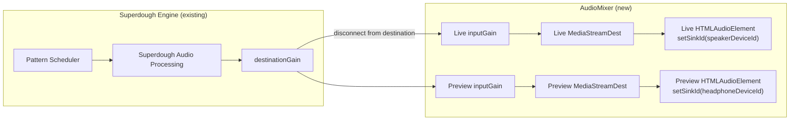
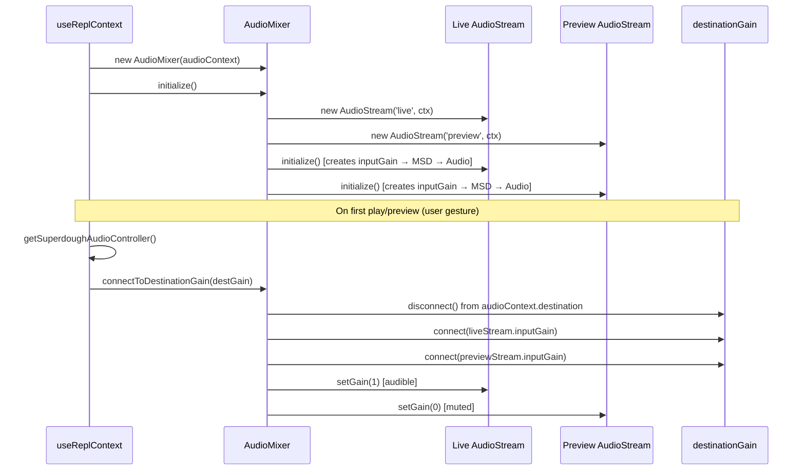
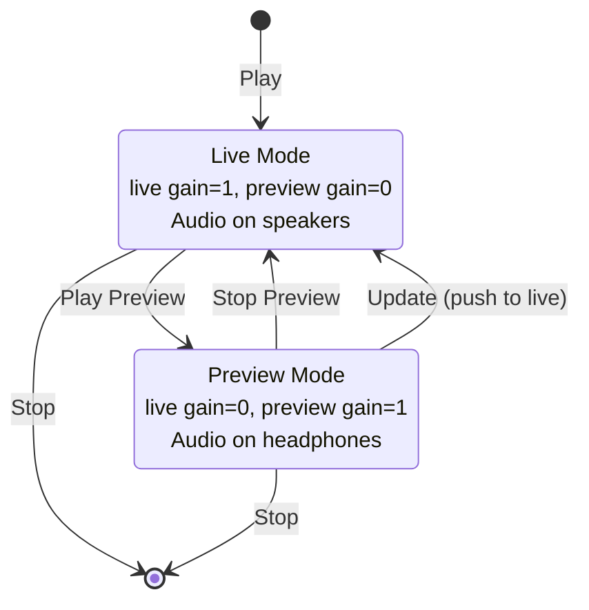

# Design Document: DJ-Style Audio Mixer with Preview Stream

## Overview

This design implements a gain-based audio routing system for Strudel that enables live coders to preview code changes on a separate audio output device (headphones) before pushing them live (speakers). The system intercepts Strudel's single superdough audio engine output and splits it into two gain-controlled streams, each routable to a different physical device.

Key design decisions:
- **Single AudioContext, single superdough engine**: Rather than creating two separate audio engines (which would require two Repl instances and two schedulers), we intercept the existing `SuperdoughOutput.destinationGain` and split it to two AudioStream instances. This is simpler and avoids module singleton issues.
- **Gain-based routing, not content separation**: Both streams receive the same audio signal. The mixer controls which device hears audio by toggling gain values (live=1/preview=0 or live=0/preview=1). You cannot play different patterns on speakers vs headphones simultaneously.
- **No direct superdough imports in mixer package**: The `@strudel/mixer` package does NOT import from `@strudel/superdough` or `@strudel/webaudio`. The caller (useReplContext.tsx) passes the real `destinationGain` GainNode via `connectToDestinationGain(gainNode)`. This avoids cross-package singleton mismatches.
- **Deferred connection**: The mixer initializes eagerly (creates AudioStream nodes on a suspended AudioContext), but only connects to superdough's destinationGain on first user gesture (play/preview).
- **HTMLAudioElement + setSinkId for device routing**: Each AudioStream uses `inputGain → MediaStreamDestination → HTMLAudioElement.setSinkId(deviceId)` to route to a specific physical output device.

## Architecture

### High-Level Audio Routing



### Connection Lifecycle



### Preview Workflow



## Components and Interfaces

### 1. AudioMixer (packages/mixer/AudioMixer.mjs)

The central coordinator. Manages two AudioStream instances and a TransitionMixer.

```javascript
class AudioMixer {
  constructor(audioContext, options = {})
  
  // Lifecycle
  async initialize()           // Create streams, restore config
  connectToDestinationGain(gainNode)  // Intercept superdough output (synchronous)
  destroy()                    // Cleanup, reconnect destGain to destination
  
  // Device management
  async getAvailableDevices()  // Enumerate audiooutput devices
  async setDevices(liveDeviceId, previewDeviceId)
  
  // Transitions
  async transition(type, duration)  // Delegate to TransitionMixer, swap streams
  
  // Persistence
  persistConfig()              // Save to localStorage
  restoreConfig()              // Load from localStorage
  reset()                      // Clear localStorage, restore defaults
  
  // State
  getState()                   // Return full mixer state snapshot
  async ensureStreamsPlaying()  // Resume HTMLAudioElements after user gesture
  
  // Properties
  audioContext                  // Shared AudioContext
  liveStream                   // AudioStream instance
  previewStream                // AudioStream instance
  transitionMixer              // TransitionMixer instance
  errorNotifier                // ErrorNotifier instance
  isInitialized                // boolean
  isConnected                  // boolean — true after connectToDestinationGain
  config                       // { liveDeviceId, previewDeviceId, transitionType, transitionDuration }
}
```

### 2. AudioStream (packages/mixer/AudioStream.mjs)

Represents a single audio output route. Does NOT contain a Repl or pattern scheduler.

```javascript
class AudioStream {
  constructor(name, audioContext)
  
  // Lifecycle
  async initialize()           // Create inputGain → MSD → HTMLAudioElement
  destroy()                    // Pause audio, disconnect nodes
  
  // Device routing
  async setDevice(deviceId)    // HTMLAudioElement.setSinkId(deviceId)
  async ensurePlaying()        // Resume HTMLAudioElement if paused
  
  // Gain control
  getInput()                   // Returns inputGain GainNode (connect sources here)
  setGain(value)               // Clamp 0-1, set inputGain.gain.value
  getGain()                    // Read current gain
  
  // State
  getState()                   // { name, isInitialized, isActive, deviceId, gain }
  
  // Audio chain: inputGain → mediaStreamDest → audioElement
  // inputGain: GainNode
  // mediaStreamDest: MediaStreamDestinationNode
  // audioElement: HTMLAudioElement (with setSinkId for device routing)
}
```

### 3. TransitionMixer (packages/mixer/TransitionMixer.mjs)

Handles gain-based transitions between streams.

```javascript
class TransitionMixer {
  constructor(audioContext, liveStream, previewStream)
  
  async execute(type, duration)   // Dispatch to instantSwitch or crossfade
  async instantSwitch()           // Immediately swap gain values
  async crossfade(duration)       // Schedule linear gain ramps
  
  notifyTransitionState(state, type, duration, error)  // Dispatch CustomEvent
  getState()                      // { isTransitioning }
  destroy()                       // Cleanup references
  
  isTransitioning                 // boolean — mutex for transitions
}
```

### 4. ErrorNotifier (packages/mixer/ErrorNotifier.mjs)

Centralized error notification with listener pattern.

```javascript
class ErrorNotifier {
  constructor()
  
  notify(error)                // Log + notify listeners + add to history
  subscribe(listener)          // Returns unsubscribe function
  getHistory(limit)            // Recent errors
  clearHistory()
  getErrorCounts()             // Counts by error type
}
```

### 5. KeyboardShortcutManager (packages/mixer/KeyboardShortcutManager.mjs)

Flexible keyboard shortcut system with conflict detection.

```javascript
class KeyboardShortcutManager {
  constructor()
  
  register(id, config)         // { key, ctrl, shift, alt, handler, description }
  unregister(id)
  findConflict(key, ctrl, shift, alt)
  
  enable()                     // Add keydown listener
  disable()                    // Remove keydown listener
  
  getShortcuts()               // List all registered shortcuts
  loadCustomShortcuts(storageKey)
  saveCustomShortcuts(storageKey)
  destroy()
}
```

### 6. Integration Point: useReplContext.tsx

The React hook that wires the mixer into the Strudel REPL.

```typescript
// In useReplContext.tsx:
// - Creates AudioMixer on mount, destroys on unmount
// - On first play/preview: gets destinationGain via getSuperdoughAudioController()
//   and calls mixer.connectToDestinationGain(destGain)
// - handlePreviewToggle: toggles gain values (live↔preview)
// - handleEvaluate ("Update"): if previewing, pushes to live (gain swap + exit preview)
// - Exposes mixer, isPreviewing, handlePreviewToggle via ReplContext
```

### 7. UI Components

- **Header.tsx**: "Play Preview" / "Stop Preview" button (visible when mixer.isInitialized)
- **MixerSettings.tsx**: Device selection dropdowns, transition type/duration controls, status indicator. Auto-refreshes device list on plug/unplug via `navigator.mediaDevices.addEventListener('devicechange', ...)`.
- **MixerControls.tsx**: Standalone mixer control panel (mode toggle, device selection, transition buttons). Currently not wired into the main UI — MixerSettings is used instead.

## Data Models

### MixerConfiguration (persisted to localStorage)

```typescript
interface MixerConfiguration {
  liveDeviceId: string | null;
  previewDeviceId: string | null;
  transitionType: 'instant' | 'crossfade';
  transitionDuration: number; // seconds, default 2.0
}
```

### StreamState

```typescript
interface StreamState {
  name: 'live' | 'preview';
  isInitialized: boolean;
  isActive: boolean;
  deviceId: string | null;
  gain: number; // 0-1
}
```

### MixerState

```typescript
interface MixerState {
  isInitialized: boolean;
  isConnected: boolean;
  config: MixerConfiguration;
  liveStream: StreamState | null;
  previewStream: StreamState | null;
  isTransitioning: boolean;
}
```


## Correctness Properties

*A property is a characteristic or behavior that should hold true across all valid executions of a system—essentially, a formal statement about what the system should do. Properties serve as the bridge between human-readable specifications and machine-verifiable correctness guarantees.*

### Property 1: Configuration Round-Trip Persistence

*For any* valid MixerConfiguration (with arbitrary liveDeviceId, previewDeviceId, transitionType in {'instant','crossfade'}, and transitionDuration > 0), persisting the configuration to localStorage and then restoring it into a new AudioMixer instance should produce an equivalent configuration object.

**Validates: Requirements 2.6, 7.1, 7.2, 7.3**

### Property 2: Transition Stream Swap

*For any* AudioMixer with initialized streams, after executing a transition (of any type), the liveStream reference should point to what was previously the previewStream, and the previewStream reference should point to what was previously the liveStream.

**Validates: Requirements 4.4**

### Property 3: Transition Mutual Exclusion

*For any* AudioMixer with a transition in progress, attempting to initiate another transition should throw an error with message "Transition in progress", and the original transition should complete normally.

**Validates: Requirements 4.5**

### Property 4: Destroy Reconnects Destination

*For any* AudioMixer that has been connected to a destinationGain node, calling destroy() should reconnect that destinationGain to audioContext.destination, restoring normal audio routing regardless of the mixer's current gain state or transition state.

**Validates: Requirements 6.3, 8.4, 9.2**

### Property 5: ConnectToDestinationGain Idempotence

*For any* AudioMixer, calling connectToDestinationGain(gainNode) multiple times with the same gainNode should have the same effect as calling it once — the isConnected flag should be true and the audio routing should be identical.

**Validates: Requirements 9.4**

### Property 6: Error History Bounded Size

*For any* sequence of N error notifications sent to an ErrorNotifier (where N > 50), the error history should contain exactly 50 entries (the most recent 50), and all subscribed listeners should have been notified of each error.

**Validates: Requirements 8.5**

### Property 7: Shortcut Conflict Detection

*For any* two keyboard shortcuts registered with the KeyboardShortcutManager that share the same key, ctrl, shift, and alt combination, the second registration should detect and report a conflict with the first.

**Validates: Requirements 10.5**

### Property 8: Shortcut Persistence Round-Trip

*For any* set of registered keyboard shortcuts, saving them to localStorage and then loading them into a new KeyboardShortcutManager should produce equivalent shortcut bindings (same key, ctrl, shift, alt for each shortcut ID).

**Validates: Requirements 10.6**

## Error Handling

### Error Categories

| Category | Trigger | Handling | Recovery |
|----------|---------|----------|----------|
| Device failure | setSinkId rejects | Log warning, clear deviceId, continue with default | Automatic fallback |
| Device unavailable | Device unplugged | MixerSettings detects via devicechange event, resets selection | Automatic |
| setSinkId unsupported | Browser doesn't support API | Log warning, skip device routing | Graceful degradation |
| Init failure | AudioStream/AudioMixer init throws | Clear stored config, retry once | Automatic retry |
| Transition conflict | Transition while another in progress | Throw error, caller handles | Caller retry |
| React Strict Mode | Unmount/remount cycle | destroy() reconnects destGain, new instance re-initializes | Automatic (KNOWN BUG: see below) |

### Known Bug: React Strict Mode Double-Mount

**Problem**: In React Strict Mode (development), `useEffect` runs twice: mount → unmount → mount. The first mixer's `destroy()` reconnects `destinationGain` to `audioContext.destination`. Then the second mixer connects streams. But because `destinationGain` is now connected to BOTH `audioContext.destination` (from destroy) AND the new streams, audio goes to both the default speakers AND the stream devices simultaneously.

**Root Cause**: `destroy()` calls `destinationGain.connect(audioContext.destination)` but the second `connectToDestinationGain()` only calls `destinationGain.disconnect()` before reconnecting to streams. The issue is a race condition in the mount/unmount/mount cycle.

**Fix Required**: The `connectToDestinationGain` method should call `gainNode.disconnect()` to remove ALL connections (including the one to `audioContext.destination` that `destroy()` added) before connecting to the streams. This is already implemented but needs verification that the disconnect-then-connect sequence is atomic enough for React Strict Mode.

### Known Limitation: Single Pattern Engine

**Limitation**: There is only ONE pattern engine/scheduler (the StrudelMirror's Repl). Both streams share the same audio source. You cannot play different content on speakers vs headphones simultaneously. The mixer only controls gain routing — it mutes one device while unmuting the other.

**Impact**: The "Play Preview" workflow evaluates the current editor code and routes ALL audio to headphones. It does not maintain a separate "live" pattern playing on speakers. When you "Stop Preview", audio returns to speakers with whatever pattern was last evaluated.

**Mitigation**: This is by design for the current implementation. True dual-pattern support would require two Repl instances with two separate superdough controllers, which is a significantly larger architectural change.

## Testing Strategy

### Dual Testing Approach

- **Unit tests**: Verify specific examples, edge cases, error conditions (Vitest)
- **Property tests**: Verify universal properties across randomized inputs (fast-check + Vitest)

### Property-Based Testing

Library: **fast-check** (already installed in `packages/mixer/node_modules/fast-check`)
Framework: **Vitest** (configured in `packages/mixer/vitest.config.js`)

Configuration:
- Minimum **100 iterations** per property test
- Each test tagged with: `// Feature: audio-mixer-preview, Property N: [description]`
- Each correctness property implemented as a SINGLE property-based test

### Unit Test Categories

1. **Initialization**: Default config, custom config, stream creation, idempotent init
2. **Device Management**: Set devices, enumerate devices, fallback on failure
3. **Configuration Persistence**: Persist, restore, reset, stale device cleanup
4. **Transitions**: Instant switch, crossfade, mutual exclusion, stream swap
5. **Destroy/Cleanup**: Resource cleanup, destGain reconnection, React Strict Mode cycle
6. **Error Handling**: Device failure, init failure, setSinkId unsupported
7. **UI Components**: MixerSettings rendering, device dropdowns, transition controls

### Existing Tests

File: `packages/mixer/test/AudioMixer.test.mjs`
- Initialization tests (default config, custom config, stream creation)
- Device management tests (enumerate, set devices)
- Configuration persistence tests (persist, restore, reset)
- State management tests
- Cleanup tests

### Test Gaps (Need Implementation)

1. Property tests for all 8 correctness properties
2. React Strict Mode destroy→reinitialize cycle test
3. TransitionMixer unit tests (instant, crossfade, mutual exclusion)
4. AudioStream unit tests (setDevice, setGain, ensurePlaying)
5. ErrorNotifier unit tests (notify, subscribe, history bounds)
6. KeyboardShortcutManager unit tests (register, conflict detection, persistence)

### Running Tests

```bash
# Run mixer tests
pnpm --filter @strudel/mixer test

# Run with UI
pnpm --filter @strudel/mixer test-ui
```
