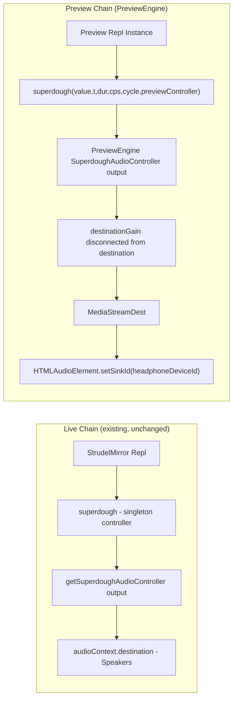
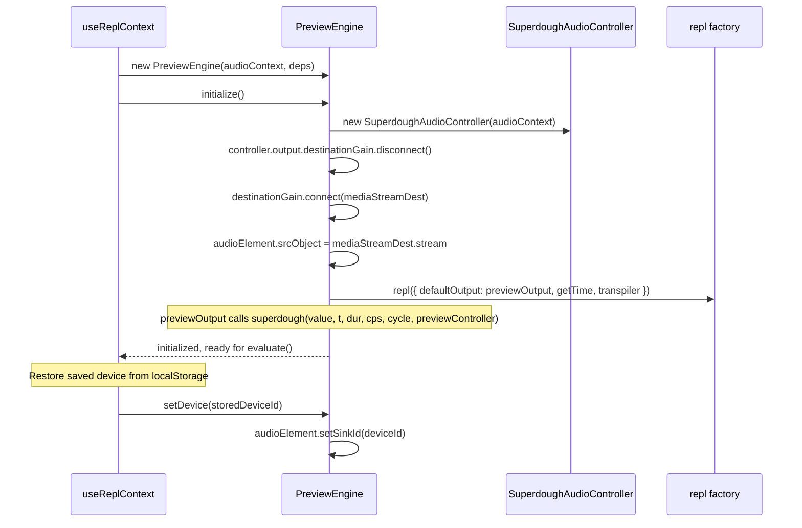
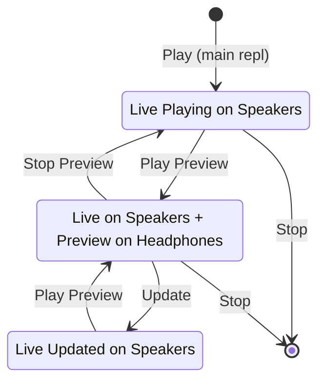

# Design Document: DJ-Style Audio Preview with Dual-Engine Architecture

## Overview

This design implements a dual-engine audio preview system for Strudel that enables live coders to preview code changes on headphones while the live pattern continues playing on speakers. Unlike the previous gain-based routing approach (which split a single audio signal to two devices), this architecture creates a truly independent audio engine for preview.

Key design decisions:
- **Dual-engine, not gain-based routing**: The `PreviewEngine` creates its own `SuperdoughAudioController` and `repl()` instance. This means the performer can hear DIFFERENT patterns on speakers vs headphones simultaneously — the preview evaluates the current editor code independently while the live pattern keeps playing.
- **Shared AudioContext**: Both engines share the same `AudioContext` (browser limitation: one per page). The preview engine disconnects its controller's `destinationGain` from `audioContext.destination` and routes through `MediaStreamDest → HTMLAudioElement.setSinkId(headphoneDeviceId)`.
- **`_controller` parameter on `superdough()`**: The `superdough()` function in `@strudel/superdough` accepts an optional 6th parameter `_controller` that overrides the default singleton `getSuperdoughAudioController()`. This is the key mechanism that allows the preview engine to route audio through its own controller.
- **Dependency injection**: The `PreviewEngine` receives all dependencies (superdough, repl, SuperdoughAudioController, getTime, transpiler) via constructor to avoid cross-package singleton mismatches.
- **Live chain untouched**: The main `StrudelMirror` repl and its singleton superdough controller are completely unmodified. The preview engine is additive — it creates a parallel audio path.

## Architecture

### High-Level Dual-Engine Audio Routing


```mermaid
graph LR
    subgraph "Live Chain (existing, unchanged)"
        LR[StrudelMirror Repl] --> LS[superdough - singleton controller]
        LS --> LC[getSuperdoughAudioController output]
        LC --> LD[audioContext.destination - Speakers]
    end

    subgraph "Preview Chain (PreviewEngine)"
        PR[Preview Repl Instance] --> PS["superdough(value,t,dur,cps,cycle,previewController)"]
        PS --> PC[PreviewEngine SuperdoughAudioController output]
        PC --> PG[destinationGain disconnected from destination]
        PG --> MSD[MediaStreamDest]
        MSD --> AE["HTMLAudioElement.setSinkId(headphoneDeviceId)"]
    end
```

### PreviewEngine Initialization Sequence


```mermaid
sequenceDiagram
    participant UC as useReplContext
    participant PE as PreviewEngine
    participant SAC as SuperdoughAudioController
    participant R as repl factory

    UC->>PE: new PreviewEngine(audioContext, deps)
    UC->>PE: initialize()
    PE->>SAC: new SuperdoughAudioController(audioContext)
    PE->>PE: controller.output.destinationGain.disconnect()
    PE->>PE: destinationGain.connect(mediaStreamDest)
    PE->>PE: audioElement.srcObject = mediaStreamDest.stream
    PE->>R: repl({ defaultOutput: previewOutput, getTime, transpiler })
    Note over PE: previewOutput calls superdough(value, t, dur, cps, cycle, previewController)
    PE-->>UC: initialized, ready for evaluate()
    
    Note over UC: Restore saved device from localStorage
    UC->>PE: setDevice(storedDeviceId)
    PE->>PE: audioElement.setSinkId(deviceId)
```

### Preview Workflow


```mermaid
stateDiagram-v2
    [*] --> LivePlaying: Play (main repl)
    LivePlaying: Live Playing on Speakers
    
    LivePlaying --> LiveAndPreview: Play Preview
    LiveAndPreview: Live on Speakers + Preview on Headphones
    
    LiveAndPreview --> LivePlaying: Stop Preview
    
    LiveAndPreview --> LiveUpdated: Update
    LiveUpdated: Live Updated on Speakers
    
    LiveUpdated --> LiveAndPreview: Play Preview
    LivePlaying --> [*]: Stop
    LiveAndPreview --> [*]: Stop
```

## Components and Interfaces

### 1. PreviewEngine (packages/mixer/PreviewEngine.mjs)

The independent audio engine for preview. Creates its own SuperdoughAudioController and repl instance.

```javascript
class PreviewEngine {
  constructor(audioContext, deps)
  // deps: { superdough, repl, getTime, SuperdoughAudioController, transpiler }
  
  // Lifecycle
  async initialize()           // Create controller, repl, audio routing
  destroy()                    // Stop repl, disconnect audio, cleanup
  
  // Playback
  async evaluate(code)         // Evaluate code on preview repl (plays on headphones)
  stop()                       // Stop preview repl playback
  
  // Device routing
  async setDevice(deviceId)    // HTMLAudioElement.setSinkId(deviceId)
  async ensurePlaying()        // Resume HTMLAudioElement after user gesture
  
  // State
  isInitialized                // boolean
  isPlaying                    // boolean
  deviceId                     // string | null
  controller                   // SuperdoughAudioController (own instance)
  replInstance                 // repl instance (own instance)
  audioElement                 // HTMLAudioElement
  mediaStreamDest              // MediaStreamDestinationNode
}
```

### 2. Integration Point: useReplContext.tsx

The React hook that wires the PreviewEngine into the Strudel REPL.

```typescript
// In useReplContext.tsx:
// - Creates PreviewEngine on mount via useEffect, destroys on unmount
// - Dependencies injected: superdough, createRepl, SuperdoughAudioController, transpiler
// - Restores saved preview device from localStorage on init
// - handlePreviewToggle:
//     Play Preview: engine.evaluate(editorRef.current.code) -> headphones
//     Stop Preview: engine.stop() -> headphones silent, speakers continue
// - handleEvaluate ("Update"): if isPreviewing, stop preview + evaluate on main repl
// - Exposes: mixer (PreviewEngine), isPreviewing, handlePreviewToggle, previewEngine
```

### 3. UI Components

- **Header.tsx**: "Play Preview" / "Stop Preview" button. Visible when `mixer.isInitialized`. Blue tint when `isPreviewing`. Calls `handlePreviewToggle`.
- **MixerSettings.tsx**: Preview device selection dropdown. Status indicator. Auto-refreshes device list on plug/unplug. Currently references old AudioMixer API methods (`getAvailableDevices()`, `setDevices()`, `persistConfig()`) that need updating to PreviewEngine API.

### 4. Legacy Classes (still exported, not used by main app)

- **AudioMixer** (packages/mixer/AudioMixer.mjs): Old gain-based routing coordinator
- **AudioStream** (packages/mixer/AudioStream.mjs): Old single audio output route
- **TransitionMixer** (packages/mixer/TransitionMixer.mjs): Old gain-based transition handler
- **ErrorNotifier** (packages/mixer/ErrorNotifier.mjs): Centralized error notification
- **KeyboardShortcutManager** (packages/mixer/KeyboardShortcutManager.mjs): Keyboard shortcut system

## Data Models

### PreviewEngine State

```typescript
interface PreviewEngineState {
  isInitialized: boolean;
  isPlaying: boolean;
  deviceId: string | null;
}
```

### Preview Device Persistence (localStorage)

```typescript
// Key: 'strudel-preview-device'
// Value: string (deviceId) or null
```

### ReplContext Preview Fields

```typescript
interface ReplContext {
  // ... existing fields ...
  mixer: PreviewEngine | null;
  isPreviewing: boolean;
  handlePreviewToggle: () => Promise<void>;
  previewEngine: PreviewEngine | null;
}
```

## Correctness Properties

*A property is a characteristic or behavior that should hold true across all valid executions of a system — essentially, a formal statement about what the system should do. Properties serve as the bridge between human-readable specifications and machine-verifiable correctness guarantees.*

### Property 1: Preview Device Persistence Round-Trip

*For any* valid device ID string, persisting it to localStorage under key `strudel-preview-device` and then restoring it during PreviewEngine initialization should result in the PreviewEngine's `deviceId` matching the original persisted value.

**Validates: Requirements 2.2, 2.3, 7.1, 7.2**

### Property 2: Destroy Cleanup Completeness

*For any* initialized PreviewEngine (whether idle, playing, or with a device set), calling `destroy()` should result in: `isInitialized === false`, `isPlaying === false`, `audioElement === null`, `controller === null`, `replInstance === null`, and `mediaStreamDest === null`.

**Validates: Requirements 6.3, 8.4, 9.2**

### Property 3: Preview Independence from Live Chain

*For any* sequence of PreviewEngine operations (initialize, evaluate, stop, setDevice, destroy), the live chain's singleton `getSuperdoughAudioController()` output connections and the main StrudelMirror repl's playing state should remain unchanged.

**Validates: Requirements 1.5**

### Property 4: Destroy-Reinitialize Cycle Safety

*For any* number of sequential destroy-then-reinitialize cycles on PreviewEngine instances sharing the same AudioContext, each new instance should have a fresh, independent `controller` and `replInstance`, and the AudioContext's destination should not accumulate stale connections from destroyed instances.

**Validates: Requirements 9.1, 9.3**

## Error Handling

### Error Categories

| Category | Trigger | Handling | Recovery |
|----------|---------|----------|----------|
| Device failure | setSinkId rejects | Log warning, clear deviceId, continue with default | Automatic fallback |
| setSinkId unsupported | Browser lacks API | Log warning, skip device routing | Graceful degradation |
| Init failure | PreviewEngine init throws | Log error, continue without preview (live unaffected) | Manual retry on next mount |
| Evaluate failure | Preview code throws | Error logged, preview stops | User fixes code and retries |
| React unmount | Component unmount | destroy() cleans up all resources | Automatic on remount |

### Key Error Handling Patterns

1. **Device fallback**: When `setSinkId` fails or device is unavailable, the PreviewEngine clears `this.deviceId` and continues with default audio output. The stored localStorage value is also cleared.

2. **Non-fatal initialization**: If `getAudioContext()` returns null or `SuperdoughAudioController` construction fails, the PreviewEngine logs the error and the UI simply doesn't show the preview button (`mixer.isInitialized` stays false).

3. **Destroy safety**: `destroy()` uses try/catch around `destinationGain.disconnect()` since the node may not be connected. All references are nulled regardless of disconnect success.

## Testing Strategy

### Dual Testing Approach

- **Unit tests**: Verify specific examples, edge cases, error conditions (Vitest)
- **Property tests**: Verify universal properties across randomized inputs (fast-check + Vitest)

### Property-Based Testing

Library: **fast-check** (already available in `packages/mixer/`)
Framework: **Vitest** (configured in `packages/mixer/vitest.config.js`)

Configuration:
- Minimum **100 iterations** per property test
- Each test tagged with: `// Feature: audio-mixer-preview, Property N: [description]`
- Each correctness property implemented as a SINGLE property-based test

### Unit Test Categories

1. **PreviewEngine lifecycle**: initialize, destroy, re-initialize
2. **Device management**: setDevice, setSinkId fallback, device persistence
3. **Preview workflow**: evaluate, stop, evaluate-then-stop sequence
4. **UI components**: Header preview button rendering, MixerSettings device dropdown
5. **Integration**: useReplContext preview toggle, Update-while-previewing flow

### Test Gaps (Need Implementation)

1. Property tests for all 4 correctness properties
2. MixerSettings unit tests adapted for PreviewEngine API (currently tests old AudioMixer API)
3. PreviewEngine unit tests for evaluate/stop/setDevice
4. Integration test for destroy-reinitialize cycle

### Running Tests

```bash
# Run mixer tests
pnpm --filter @strudel/mixer test

# Run with UI
pnpm --filter @strudel/mixer test-ui
```
