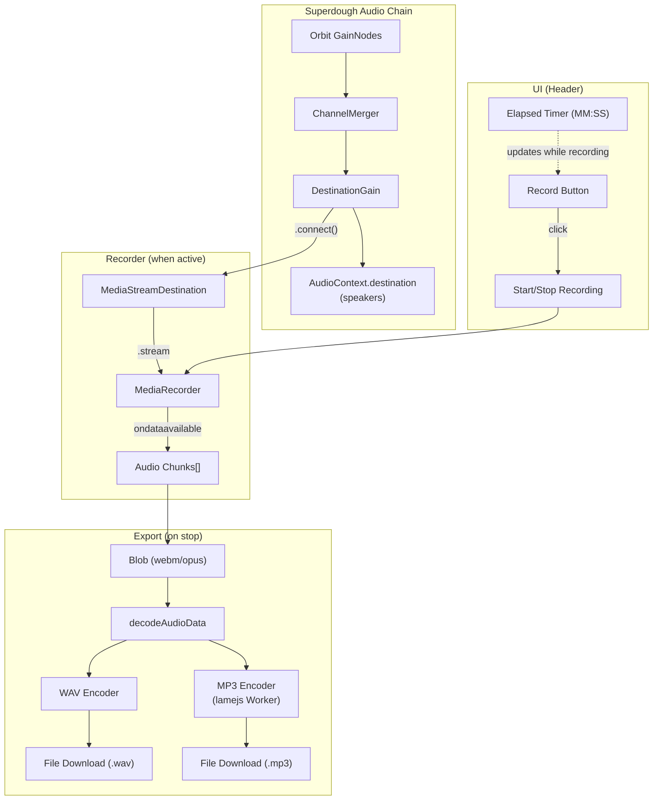
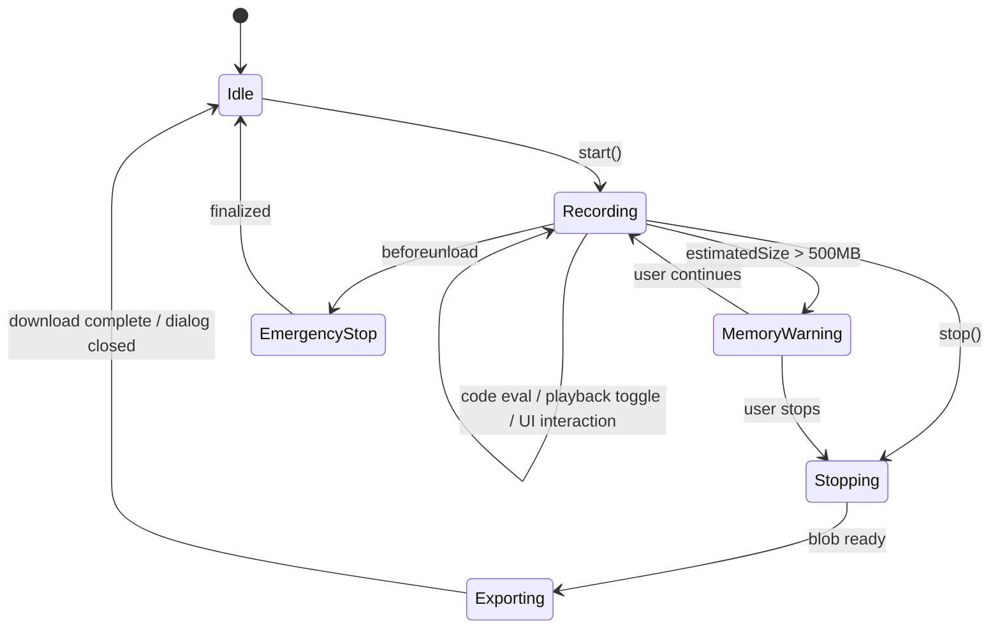

# Design Document: Audio Recorder

## Overview

The Audio Recorder feature enables users to capture the live audio output of the Strudel REPL directly in the browser. It taps into the existing superdough audio pipeline at the `DestinationGain` node (the final GainNode before `AudioContext.destination`) using a `MediaStreamDestination` node. Audio data is captured via `MediaRecorder`, accumulated as chunks, and exported as WAV (PCM 16-bit stereo) or MP3 (192 kbps via lamejs).

The recorder is controlled through a record button in the Header component, with elapsed time display. Recording persists across code evaluations, playback toggles, UI interactions (file manager, settings), and track navigation. A memory warning triggers at 500 MB estimated usage.

### Key Design Decisions

1. **Tap point: DestinationGain** — Connecting a `MediaStreamDestination` to the existing `DestinationGain` node captures all mixed audio (all orbits, effects, etc.) without modifying the playback chain. This is the same pattern used by `PreviewEngine` and `AudioMixer`.

2. **MediaRecorder over ScriptProcessorNode** — `MediaRecorder` with `audio/webm;codecs=opus` is the most efficient browser-native approach for capturing audio streams. Raw PCM is obtained by decoding the recorded blob via `AudioContext.decodeAudioData` for WAV/MP3 encoding.

3. **Website-level module, not a package** — The recorder is UI-coupled (Header button, export dialog, elapsed time display) and only used in the website. It lives in `website/src/repl/` rather than as a separate `@strudel/` package.

4. **lamejs for MP3 encoding** — lamejs is a pure-JS MP3 encoder that runs in a Web Worker to avoid blocking the UI/audio thread during encoding.

## Architecture



### Integration Points

1. **SuperdoughOutput.destinationGain** — accessed via `getSuperdoughAudioController().output.destinationGain`. The recorder connects/disconnects its `MediaStreamDestination` to this node.

2. **Header component** (`website/src/repl/components/Header.tsx`) — receives recorder state via the `ReplContext` and renders the record button + elapsed time.

3. **useReplContext** (`website/src/repl/useReplContext.tsx`) — instantiates and manages the `AudioRecorderEngine`, exposes recording state and handlers to the context.

4. **Export Dialog** — a small React modal shown after recording stops, letting the user choose WAV or MP3 before download.

## Components and Interfaces

### AudioRecorderEngine

Core recording engine class. Lives at `website/src/repl/recording/AudioRecorderEngine.ts`.

```typescript
interface RecorderState {
  isRecording: boolean;
  elapsedSeconds: number;
  estimatedSizeMB: number;
  error: string | null;
}

interface RecorderOptions {
  memoryWarningThresholdMB?: number; // default: 500
  onStateChange?: (state: RecorderState) => void;
  onMemoryWarning?: (sizeMB: number) => void;
}

class AudioRecorderEngine {
  constructor(audioContext: AudioContext, options?: RecorderOptions);

  /** Connect MediaStreamDestination to the given GainNode and start MediaRecorder */
  start(destinationGain: GainNode): void;

  /** Stop MediaRecorder, disconnect nodes, return captured blob */
  stop(): Promise<Blob>;

  /** Get current state */
  getState(): RecorderState;

  /** Release all resources */
  destroy(): void;
}
```

### WAV Encoder

Pure function that converts an `AudioBuffer` to a WAV `Blob`. Lives at `website/src/repl/recording/wavEncoder.ts`.

```typescript
function encodeWAV(audioBuffer: AudioBuffer): Blob;
```

Produces PCM 16-bit stereo at the AudioBuffer's sample rate. This is a synchronous CPU-bound operation but fast enough for typical recording lengths (< 1 hour).

### MP3 Encoder (Web Worker)

Encodes an `AudioBuffer` to MP3 via lamejs in a Web Worker. Lives at `website/src/repl/recording/mp3Encoder.ts` + `website/src/repl/recording/mp3Worker.ts`.

```typescript
function encodeMP3(audioBuffer: AudioBuffer, bitrate?: number): Promise<Blob>;
function isMP3Available(): boolean;
```

### ExportDialog Component

React modal shown after recording stops. Lives at `website/src/repl/components/ExportDialog.tsx`.

```typescript
interface ExportDialogProps {
  audioBlob: Blob;
  audioContext: AudioContext;
  onClose: () => void;
}
```

Shows format selection (WAV / MP3), encoding progress indicator, and triggers browser download.

### Header Integration

The Header component receives these additional props via `ReplContext`:

```typescript
// Added to ReplContext interface
interface ReplContext {
  // ... existing fields ...
  isRecording: boolean;
  recordingElapsedSeconds: number;
  handleRecordToggle: () => void;
}
```

### Recording State Hook

A custom hook `useAudioRecorder` in `website/src/repl/recording/useAudioRecorder.ts` manages the lifecycle:

```typescript
function useAudioRecorder(): {
  isRecording: boolean;
  elapsedSeconds: number;
  handleRecordToggle: () => void;
  exportBlob: Blob | null;
  clearExport: () => void;
  error: string | null;
};
```

## Data Models

### Audio Chunk Storage

```typescript
// Internal to AudioRecorderEngine
interface ChunkStore {
  chunks: Blob[];           // Incremental webm/opus chunks from MediaRecorder
  totalBytes: number;       // Running byte count for memory estimation
  startTime: number;        // Date.now() when recording started
  sampleRate: number;       // AudioContext.sampleRate at recording start
}
```

### Export Metadata

```typescript
interface ExportMetadata {
  format: 'wav' | 'mp3';
  filename: string;         // "strudel-recording-YYYY-MM-DD-HHmmss.{ext}"
  durationSeconds: number;
  sampleRate: number;
  channels: 2;              // Always stereo
  bitrate?: number;         // MP3 only, 192 kbps
}
```

### Recording State Flow




## Correctness Properties

*A property is a characteristic or behavior that should hold true across all valid executions of a system — essentially, a formal statement about what the system should do. Properties serve as the bridge between human-readable specifications and machine-verifiable correctness guarantees.*

### Property 1: Recording lifecycle round-trip

*For any* valid AudioContext and GainNode, calling `start(gainNode)` followed by `stop()` on the AudioRecorderEngine should return the engine to an idle state (isRecording=false, no active MediaRecorder, no connected MediaStreamDestination) and produce a non-empty Blob.

**Validates: Requirements 1.1, 1.3**

### Property 2: Recording state toggle

*For any* AudioRecorderEngine in idle state, calling the record toggle should transition it to recording (isRecording=true). For any engine in recording state, calling the record toggle should transition it to idle and produce an export blob.

**Validates: Requirements 2.2, 2.3**

### Property 3: Elapsed time formatting

*For any* non-negative integer number of seconds, the elapsed time formatter should produce a string matching the pattern `MM:SS` where MM is zero-padded minutes and SS is zero-padded seconds (e.g., 0 → "00:00", 61 → "01:01", 3599 → "59:59", 3600 → "60:00").

**Validates: Requirements 2.5**

### Property 4: Recording persistence across external actions

*For any* active recording session and any external action (code evaluation, playback toggle, file manager open/close, track navigation), the recording state should remain `isRecording=true` and the MediaRecorder should remain in the "recording" state.

**Validates: Requirements 3.1, 3.2, 6.1, 6.2**

### Property 5: WAV encoding correctness

*For any* AudioBuffer with 2 channels and any sample rate, the WAV encoder should produce a Blob whose first 44 bytes contain a valid RIFF/WAVE header with: format=PCM (1), numChannels=2, bitsPerSample=16, sampleRate matching the input, and data chunk size equal to `numSamples × numChannels × 2`.

**Validates: Requirements 4.1**

### Property 6: Export filename generation

*For any* Date and any format in {wav, mp3}, the filename generator should produce a string matching `strudel-recording-YYYY-MM-DD-HHmmss.{format}` where the date components are zero-padded and derived from the input Date.

**Validates: Requirements 4.2, 5.3**

### Property 7: Memory warning threshold

*For any* sequence of audio chunks whose cumulative byte size exceeds 500 MB (524,288,000 bytes), the recorder should invoke the memory warning callback. For any sequence below the threshold, the callback should not be invoked.

**Validates: Requirements 7.2**

### Property 8: Resource cleanup after export

*For any* completed recording session, after the export is finalized (download triggered or dialog closed), the engine's internal chunk store should be empty (chunks.length === 0, totalBytes === 0) and all Web Audio nodes (MediaStreamDestination, MediaRecorder) should be released (null references).

**Validates: Requirements 7.3**

## Error Handling

| Scenario | Handling |
|---|---|
| AudioContext not running (suspended) | `start()` checks `audioContext.state`. If not "running", sets `error` state with message "Audio playback must be active before recording. Press play first." and does not create MediaRecorder. |
| MediaRecorder not supported | `start()` catches constructor error. Falls back to error state. This is unlikely in modern browsers but handled gracefully. |
| Empty recording (zero duration) | `stop()` checks if chunks array is empty or total duration is 0. If so, sets a warning and skips export dialog. |
| lamejs fails to load | `isMP3Available()` returns false. Export dialog disables MP3 option and shows "Only WAV export is available." |
| MP3 encoding fails mid-encode | Worker posts error message. Export dialog shows error and falls back to offering WAV download. |
| Memory warning (>500 MB) | `onMemoryWarning` callback fires. UI shows a non-blocking warning banner: "Recording is using a lot of memory (~X MB). Consider stopping soon." Recording continues unless user stops. |
| Page unload during recording | `beforeunload` handler calls `stop()` synchronously (best-effort), creates WAV blob, and triggers download via `URL.createObjectURL` + click. Browser may or may not complete the download. |
| MediaRecorder `onerror` event | Stops recording, sets error state, attempts to salvage any chunks already captured. |

## Testing Strategy

### Property-Based Testing

Use **fast-check** as the property-based testing library (already compatible with Vitest, the project's test runner).

Each correctness property maps to a single property-based test with a minimum of 100 iterations. Tests are tagged with the format:

```
Feature: audio-recorder, Property {N}: {property title}
```

Property tests focus on:
- **Property 1**: Generate random start/stop sequences, verify state transitions
- **Property 2**: Generate random toggle sequences, verify state machine correctness
- **Property 3**: Generate random non-negative integers, verify MM:SS formatting
- **Property 4**: Generate random "external action" types, verify recording state invariant
- **Property 5**: Generate random AudioBuffer data (varying lengths, sample rates), verify WAV header correctness
- **Property 6**: Generate random Dates and formats, verify filename pattern
- **Property 7**: Generate random chunk sequences with varying sizes, verify threshold detection
- **Property 8**: Generate random recording sessions, verify cleanup after export

### Unit Testing

Unit tests complement property tests for specific examples and edge cases:

- **Edge cases**: Empty recording (0 chunks), very short recording (< 1 second), recording at boundary of 500 MB threshold
- **Error conditions**: Suspended AudioContext, missing GainNode, MediaRecorder constructor failure
- **Integration examples**: WAV encoding of a known sine wave buffer and verifying byte-level output, filename generation for specific dates (midnight, year boundary)
- **UI examples**: Record button visibility in embedded/zen modes, recording indicator CSS class when isRecording=true, export dialog rendering with MP3 available vs unavailable

### Test File Locations

- `website/src/repl/recording/__tests__/AudioRecorderEngine.test.ts` — Properties 1, 2, 4, 7, 8
- `website/src/repl/recording/__tests__/wavEncoder.test.ts` — Property 5
- `website/src/repl/recording/__tests__/formatUtils.test.ts` — Properties 3, 6
- `website/src/repl/recording/__tests__/mp3Encoder.test.ts` — MP3 encoding unit tests

### Test Configuration

```typescript
// fast-check configuration for all property tests
const FC_OPTIONS = { numRuns: 100 };
```

All property tests must reference their design document property in a comment:
```typescript
// Feature: audio-recorder, Property 5: WAV encoding correctness
```
