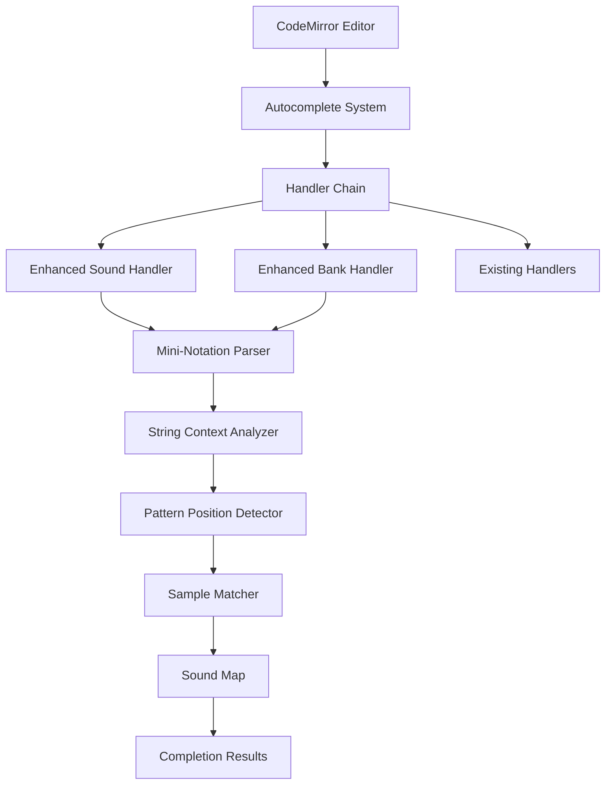

# Design Document: Enhanced Strudel Autocomplete

## Overview

This design enhances Strudel's autocomplete system to provide intelligent, context-aware code completion for mini-notation patterns within string contexts. The enhancement builds upon the existing CodeMirror 6 autocomplete infrastructure while adding sophisticated string parsing capabilities to understand mini-notation syntax, support case-insensitive matching, and provide completions inside both regular and template strings.

The core innovation is a **Mini-Notation Context Parser** that analyzes the position within a string to determine what type of completion is appropriate, recognizing pattern separators (spaces, commas), colon syntax for sample parameters, and nested pattern structures (brackets, angle brackets).

## Architecture

### High-Level Architecture



### Component Interaction Flow

1. User types in CodeMirror editor
2. Autocomplete system triggers with completion context
3. Handler chain processes context sequentially
4. Enhanced handlers detect string contexts for .s(), .sound(), .bank()
5. Mini-Notation Parser analyzes string interior
6. Pattern Position Detector identifies current element position
7. Sample Matcher performs case-insensitive filtering
8. Results returned to CodeMirror for display

## Components and Interfaces

### 1. Mini-Notation Context Parser

**Purpose**: Parse the interior of strings to identify the current pattern element and determine what completions are appropriate.

**Interface**:
```javascript
class MiniNotationContextParser {
  /**
   * Parse string context to find current pattern element
   * @param {string} stringContent - Content inside the string quotes
   * @param {number} cursorOffset - Cursor position relative to string start
   * @returns {PatternContext} Context information for completion
   */
  parseContext(stringContent, cursorOffset) {
    // Returns: { elementStart, elementEnd, fragment, contextType }
  }
  
  /**
   * Identify pattern separators and boundaries
   * @param {string} content - String content to analyze
   * @returns {number[]} Array of separator positions
   */
  findSeparators(content) {
    // Returns positions of spaces, commas, brackets
  }
  
  /**
   * Determine if position is in colon syntax context
   * @param {string} content - String content
   * @param {number} position - Current position
   * @returns {ColonContext} Information about colon syntax
   */
  analyzeColonContext(content, position) {
    // Returns: { inColonSyntax, colonPosition, parameterIndex }
  }
}
```

**Key Responsibilities**:
- Identify pattern element boundaries using mini-notation separators
- Detect colon syntax for sample:n:gain patterns
- Handle nested structures (brackets, angle brackets, parentheses)
- Track cursor position within pattern elements
- Distinguish between different mini-notation contexts

**Implementation Details**:
- Use state machine to track nesting depth
- Recognize separators: space, comma, `[`, `]`, `<`, `>`, `{`, `}`, `(`
- Special handling for colon (`:`) - continues same element
- Ignore separators inside nested structures
- Track quote type (single, double, backtick) for proper parsing

### 2. String Context Analyzer

**Purpose**: Determine if the current cursor position is inside a string argument to a sample-related method.

**Interface**:
```javascript
class StringContextAnalyzer {
  /**
   * Analyze CodeMirror context to detect string contexts
   * @param {CompletionContext} context - CodeMirror completion context
   * @returns {StringContext|null} String context information or null
   */
  analyzeContext(context) {
    // Returns: { methodName, quoteType, stringStart, stringContent, cursorOffset }
  }
  
  /**
   * Check if position is inside a method call string
   * @param {string} text - Text before cursor
   * @param {string[]} methodNames - Methods to check for
   * @returns {MethodContext|null} Method context or null
   */
  detectMethodContext(text, methodNames) {
    // Returns: { method, quotePosition, quoteType }
  }
}
```

**Key Responsibilities**:
- Detect `.s()`, `.sound()`, `.bank()` method calls
- Identify quote type (single, double, backtick)
- Extract string content up to cursor position
- Calculate cursor offset within string
- Handle template strings with embedded expressions

**Implementation Details**:
- Use regex patterns to match method calls with quotes
- Support all three quote types: `'`, `"`, `` ` ``
- Handle escaped quotes within strings
- Track nesting for template string expressions `${...}`
- Return null if not in a valid string context

### 3. Pattern Position Detector

**Purpose**: Identify the exact position within a mini-notation pattern to determine what completions are valid.

**Interface**:
```javascript
class PatternPositionDetector {
  /**
   * Detect current position type in pattern
   * @param {string} content - String content
   * @param {number} position - Cursor position
   * @returns {PositionType} Type of position
   */
  detectPositionType(content, position) {
    // Returns: 'sample_name' | 'sample_number' | 'gain' | 'euclidean_param' | 'weight'
  }
  
  /**
   * Find the current pattern element at position
   * @param {string} content - String content
   * @param {number} position - Cursor position
   * @returns {PatternElement} Current element information
   */
  getCurrentElement(content, position) {
    // Returns: { start, end, text, type }
  }
  
  /**
   * Check if position is after a pattern separator
   * @param {string} content - String content
   * @param {number} position - Cursor position
   * @returns {boolean} True if after separator
   */
  isAfterSeparator(content, position) {
    // Returns boolean
  }
}
```

**Key Responsibilities**:
- Identify if cursor is at start of new pattern element
- Detect colon syntax positions (sample:n:gain)
- Recognize euclidean rhythm parameters `(pulse, steps, rotation)`
- Identify weight syntax `@weight`
- Handle nested pattern structures

**Implementation Details**:
- Parse backwards from cursor to find element start
- Track bracket/brace nesting depth
- Recognize special characters: `:`, `@`, `(`, `)`, `[`, `]`, `<`, `>`, `{`, `}`
- Distinguish between different parameter positions in colon syntax
- Return position type to guide completion filtering

### 4. Case-Insensitive Sample Matcher

**Purpose**: Perform efficient case-insensitive matching of sample names with substring support.

**Interface**:
```javascript
class CaseInsensitiveSampleMatcher {
  /**
   * Filter samples by case-insensitive matching
   * @param {string[]} samples - Available sample names
   * @param {string} fragment - User-typed fragment
   * @param {number} maxResults - Maximum results to return
   * @returns {MatchResult[]} Sorted matching results
   */
  match(samples, fragment, maxResults = 100) {
    // Returns: [{ name, score, matchType }]
  }
  
  /**
   * Calculate match score for ranking
   * @param {string} sample - Sample name
   * @param {string} fragment - Search fragment
   * @returns {number} Match score (higher is better)
   */
  calculateScore(sample, fragment) {
    // Returns numeric score
  }
}
```

**Key Responsibilities**:
- Perform case-insensitive substring matching
- Rank results by match quality
- Prioritize prefix matches over substring matches
- Limit results to prevent performance issues
- Preserve original capitalization in results

**Implementation Details**:
- Convert both sample and fragment to lowercase for comparison
- Scoring algorithm:
  - Exact match: score = 1000
  - Prefix match: score = 500 + (1000 - sample.length)
  - Substring match: score = 100 + (1000 - matchPosition)
- Sort by score descending
- Return top N results (default 100)
- Keep original sample name for display

### 5. Enhanced Sound Handler

**Purpose**: Replace existing soundHandler with enhanced version supporting mini-notation parsing.

**Interface**:
```javascript
function enhancedSoundHandler(context) {
  // Returns: { from, options } | null
}
```

**Key Responsibilities**:
- Detect `.s()` and `.sound()` method contexts
- Parse mini-notation within strings
- Provide sample name completions at appropriate positions
- Support colon syntax for sample:n:gain
- Handle all quote types and template strings

**Implementation Details**:
- Use StringContextAnalyzer to detect method context
- Use MiniNotationContextParser to parse string interior
- Use PatternPositionDetector to identify completion position
- Use CaseInsensitiveSampleMatcher to filter samples
- Return completions only for sample name positions (not n or gain)
- Support both regular strings and template strings

### 6. Enhanced Bank Handler

**Purpose**: Replace existing bankHandler with enhanced version supporting mini-notation parsing.

**Interface**:
```javascript
function enhancedBankHandler(context) {
  // Returns: { from, options } | null
}
```

**Key Responsibilities**:
- Detect `.bank()` method contexts
- Parse mini-notation within strings
- Provide bank name completions
- Extract bank names from Sound Map
- Support template string patterns

**Implementation Details**:
- Use StringContextAnalyzer to detect method context
- Use MiniNotationContextParser to parse string interior
- Extract banks from soundMap by finding underscore-separated prefixes
- Use CaseInsensitiveSampleMatcher to filter banks
- Support pattern alternation syntax `<bank1 bank2>`

### 7. Sound Map Integration

**Purpose**: Interface with superdough's soundMap to get available samples dynamically.

**Interface**:
```javascript
class SoundMapIntegration {
  /**
   * Get all available sample names
   * @returns {string[]} Array of sample names
   */
  getAllSamples() {
    // Returns all keys from soundMap
  }
  
  /**
   * Get all available bank names
   * @returns {string[]} Array of bank names
   */
  getAllBanks() {
    // Returns unique bank prefixes
  }
  
  /**
   * Subscribe to soundMap updates
   * @param {Function} callback - Called when soundMap changes
   */
  subscribe(callback) {
    // Registers callback for updates
  }
}
```

**Key Responsibilities**:
- Query soundMap for available samples
- Extract bank names from sample keys
- Monitor soundMap for runtime updates
- Cache results for performance

**Implementation Details**:
- Access soundMap.get() to retrieve current samples
- Parse sample keys to extract banks (prefix before underscore)
- Use Set to deduplicate bank names
- Implement reactive updates when new samples load
- Cache sample/bank lists with invalidation on updates

## Data Models

### PatternContext
```javascript
{
  elementStart: number,      // Start position of current element
  elementEnd: number,        // End position of current element
  fragment: string,          // Text fragment being typed
  contextType: string,       // 'sample_name' | 'sample_number' | 'gain' | etc.
  inColonSyntax: boolean,    // True if in colon-separated syntax
  colonPosition: number,     // Position of last colon (-1 if none)
  parameterIndex: number,    // 0=sample, 1=n, 2=gain in colon syntax
  nestingDepth: number       // Depth of bracket nesting
}
```

### StringContext
```javascript
{
  methodName: string,        // 's' | 'sound' | 'bank'
  quoteType: string,         // '"' | "'" | '`'
  stringStart: number,       // Position where string starts
  stringContent: string,     // Content of string up to cursor
  cursorOffset: number       // Cursor position within string
}
```

### MatchResult
```javascript
{
  name: string,              // Original sample/bank name
  score: number,             // Match quality score
  matchType: string,         // 'exact' | 'prefix' | 'substring'
  label: string,             // Display label
  type: string               // 'sound' | 'bank' for CodeMirror
}
```

### PositionType
```javascript
type PositionType = 
  | 'sample_name'            // Position for sample name completion
  | 'sample_number'          // Position for n parameter (numeric)
  | 'gain'                   // Position for gain parameter (numeric)
  | 'euclidean_param'        // Inside (pulse, steps, rotation)
  | 'weight'                 // After @ symbol
  | 'none'                   // No completion appropriate
```

## Correctness Properties

*A property is a characteristic or behavior that should hold true across all valid executions of a system—essentially, a formal statement about what the system should do. Properties serve as the bridge between human-readable specifications and machine-verifiable correctness guarantees.*


### Property Reflection

After analyzing all acceptance criteria, I've identified the following consolidations to eliminate redundancy:

**Consolidations:**
1. Properties 1.1, 1.3, 1.4, and 1.5 can be consolidated into a single comprehensive case-insensitive matching property
2. Properties 2.1, 3.1, 4.1, and 6.1 all test method context detection and can be combined
3. Properties 5.1 and 5.2 both test separator recognition and can be combined
4. Properties 5.4 and 5.5 both test nested pattern support and can be combined
5. Properties 6.2 and 6.3 both test automatic activation and can be combined with 6.1
6. Properties 7.3, 7.4, 7.5 are specific examples that don't need separate properties - covered by 7.6
7. Properties 8.1 and 8.2 both test performance and can be combined
8. Properties 10.1, 10.2, 10.3, 10.4, 10.5 all test pattern parsing and can be consolidated

**Redundancies:**
- Property 1.2 (preserve capitalization) is implied by 1.1 (case-insensitive matching returns original)
- Property 2.2 (colon recognition) is covered by 5.3 (colon continues context)
- Property 4.5 (quote type recognition) is implied by 2.1, 3.1, 4.1 (all quote types work)
- Property 6.4 (fallback behavior) is existing functionality, not new
- Property 6.5 (explicit trigger) is existing functionality, not new
- Property 7.1 (initialization) is a one-time setup, not a property
- Property 7.2 (runtime updates) is important but covered by 7.6 (all samples included)
- Property 9.1 (maintain existing) is regression testing, not a new property

### Core Correctness Properties

Property 1: Case-Insensitive Substring Matching
*For any* sample name in the Sound_Map and any search fragment, if the fragment appears as a substring in the sample name (case-insensitive), then the sample SHALL appear in the filtered results with its original capitalization preserved.
**Validates: Requirements 1.1, 1.2, 1.5**

Property 2: Method Context Detection
*For any* cursor position inside a string argument to .s(), .sound(), or .bank() methods (with any quote type: single, double, or backtick), the Autocomplete_System SHALL provide appropriate completions (samples for .s()/.sound(), banks for .bank()).
**Validates: Requirements 2.1, 3.1, 4.1, 4.5, 6.1**

Property 3: Pattern Separator Recognition
*For any* mini-notation string containing pattern separators (spaces, commas, square brackets, angle brackets), typing after a separator SHALL trigger a new pattern element context where sample completions are provided.
**Validates: Requirements 2.5, 5.1, 5.2, 5.4, 5.5, 6.2**

Property 4: Colon Syntax Continuation
*For any* sample name followed by a colon in mini-notation, typing after the colon SHALL continue in the same element context (for n or gain parameters) and SHALL trigger autocomplete activation.
**Validates: Requirements 2.2, 5.3, 6.3**

Property 5: Bank Extraction from Sound Map
*For any* Sound_Map containing samples with underscore-separated names (e.g., "RolandTR909_kick"), the bank extraction algorithm SHALL identify unique prefixes before the first underscore as bank names.
**Validates: Requirements 3.5**

Property 6: Euclidean Rhythm Context Exclusion
*For any* pattern containing euclidean rhythm syntax `sample(pulse,steps)`, typing inside the parentheses SHALL NOT provide sample name completions (only numeric parameter context).
**Validates: Requirements 5.6, 10.3**

Property 7: Special Character Recognition
*For any* mini-notation pattern containing `~` (silence) or `-` (rest), these SHALL be recognized as complete pattern elements that do not trigger sample name completion.
**Validates: Requirements 5.7**

Property 8: Dynamic Sample Source Integration
*For any* samples present in the Sound_Map (from any source: synthesizers, sample banks, soundfonts, or custom sources), those samples SHALL be included in the autocomplete completion list.
**Validates: Requirements 7.6**

Property 9: Performance and Result Limiting
*For any* completion query, the Autocomplete_System SHALL return results within 50 milliseconds and SHALL limit results to a maximum of 100 items, prioritizing exact prefix matches over substring matches.
**Validates: Requirements 8.1, 8.2, 8.4, 8.5**

Property 10: Nested Pattern Parsing
*For any* mini-notation pattern with nested structures (brackets, braces, angle brackets) at any nesting depth, the Autocomplete_System SHALL correctly identify the current pattern element position and provide appropriate completions, recognizing context-specific separators (commas in braces for polymeter, @ for weights).
**Validates: Requirements 10.1, 10.2, 10.4, 10.5**

## Error Handling

### Invalid Input Handling

1. **Malformed Patterns**: If mini-notation syntax is malformed (unclosed brackets, mismatched quotes), the parser should gracefully degrade and provide best-effort completions based on the parseable portion.

2. **Empty Sound Map**: If soundMap is empty or unavailable, return empty completion list rather than throwing errors.

3. **Invalid Quote Nesting**: If quotes are nested incorrectly (e.g., `".s('bd")`), detect the outermost valid quote context and parse within that.

4. **Extremely Long Strings**: If string content exceeds reasonable length (>10000 characters), limit parsing to the region around the cursor (±500 characters) to maintain performance.

### Edge Cases

1. **Cursor at Quote Boundary**: When cursor is immediately after opening quote or before closing quote, provide completions as if inside the string.

2. **Multiple Colons**: In patterns like `"bd:0:0.5:extra"`, recognize only the first three colon-separated values (sample:n:gain) and treat additional colons as part of the gain value.

3. **Escaped Characters**: Handle escaped quotes within strings (`"bd\"hh"`) by treating them as regular characters, not string delimiters.

4. **Template String Expressions**: In template strings with embedded expressions like `` `.s(`bd ${x} hh`)` ``, provide completions only in the string portions, not inside `${...}`.

5. **Whitespace Variations**: Handle multiple consecutive spaces, tabs, and newlines as single separators.

### Error Recovery

1. **Parser Failures**: If MiniNotationContextParser fails, fall back to simple word-boundary detection using regex.

2. **Sound Map Access Errors**: If soundMap.get() throws an error, cache the last known good sample list and use that.

3. **Performance Degradation**: If completion calculation exceeds 50ms, return partial results (first 50 matches) rather than waiting for complete filtering.

## Testing Strategy

### Dual Testing Approach

This feature requires both unit tests and property-based tests for comprehensive coverage:

**Unit Tests** focus on:
- Specific examples from requirements (e.g., `.s("pulse:1200,gm_")` suggests "gm_*" samples)
- Edge cases (empty strings, malformed patterns, boundary conditions)
- Integration with CodeMirror context API
- Error handling scenarios

**Property-Based Tests** focus on:
- Universal properties that hold for all inputs (case-insensitive matching, separator recognition)
- Randomized pattern generation to test parser robustness
- Large-scale performance testing with thousands of samples
- Comprehensive input coverage through randomization

### Property-Based Testing Configuration

- **Library**: Use `fast-check` for JavaScript property-based testing
- **Iterations**: Minimum 100 iterations per property test
- **Test Tagging**: Each property test must reference its design document property
- **Tag Format**: `// Feature: enhanced-strudel-autocomplete, Property N: [property text]`

### Unit Test Coverage

**MiniNotationContextParser Tests**:
- Parse simple patterns: `"bd hh cp"`
- Parse colon syntax: `"bd:0:0.5"`
- Parse nested brackets: `"[bd [hh hh]]"`
- Parse angle brackets: `"<bd hh>"`
- Parse polymeter: `"{bd hh, cp sd}"`
- Parse euclidean: `"bd(3,8)"`
- Handle malformed input gracefully

**StringContextAnalyzer Tests**:
- Detect `.s()` with double quotes
- Detect `.sound()` with single quotes
- Detect `.bank()` with backticks
- Handle nested method calls
- Return null for non-string contexts

**CaseInsensitiveSampleMatcher Tests**:
- Match exact names
- Match prefixes case-insensitively
- Match substrings case-insensitively
- Preserve original capitalization
- Rank results correctly
- Limit to 100 results

**Integration Tests**:
- Complete workflow from CodeMirror context to completion results
- Test with real soundMap data
- Test with all three quote types
- Test automatic activation
- Test explicit activation (Ctrl+Space)

### Property-Based Test Examples

```javascript
// Feature: enhanced-strudel-autocomplete, Property 1: Case-Insensitive Substring Matching
test('case-insensitive substring matching preserves capitalization', () => {
  fc.assert(
    fc.property(
      fc.array(fc.string({ minLength: 1, maxLength: 20 })),  // sample names
      fc.string({ minLength: 1, maxLength: 10 }),             // search fragment
      (samples, fragment) => {
        const matcher = new CaseInsensitiveSampleMatcher();
        const results = matcher.match(samples, fragment);
        
        // All results must contain fragment (case-insensitive)
        results.forEach(result => {
          expect(result.name.toLowerCase()).toContain(fragment.toLowerCase());
        });
        
        // Original capitalization must be preserved
        results.forEach(result => {
          expect(samples).toContain(result.name);
        });
      }
    ),
    { numRuns: 100 }
  );
});

// Feature: enhanced-strudel-autocomplete, Property 3: Pattern Separator Recognition
test('separators trigger new pattern element context', () => {
  fc.assert(
    fc.property(
      fc.array(fc.constantFrom('bd', 'hh', 'cp', 'sd'), { minLength: 2, maxLength: 10 }),
      fc.constantFrom(' ', ',', '[', '<'),
      (samples, separator) => {
        const pattern = samples.join(separator);
        const parser = new MiniNotationContextParser();
        
        // Test at position after each separator
        let pos = 0;
        for (let i = 0; i < samples.length - 1; i++) {
          pos += samples[i].length + separator.length;
          const context = parser.parseContext(pattern, pos);
          
          // Should be at start of new element
          expect(context.elementStart).toBe(pos);
          expect(context.fragment).toBe('');
        }
      }
    ),
    { numRuns: 100 }
  );
});
```

### Performance Testing

- **Benchmark**: Measure completion time with 1000, 5000, and 10000 samples
- **Target**: <50ms for all sample set sizes
- **Profiling**: Identify bottlenecks in parsing and filtering
- **Optimization**: Use caching, efficient string algorithms, early termination

### Regression Testing

- **Existing Functionality**: Verify all existing autocomplete handlers still work
- **Function Completions**: Test that Strudel function completions still appear
- **Method Completions**: Test that pattern method completions still work
- **Scale Completions**: Test that scale name completions still work
- **Chord Completions**: Test that chord symbol completions still work

## Implementation Notes

### CodeMirror 6 Integration

The implementation integrates with CodeMirror 6's autocomplete system through the existing handler chain architecture:

1. **Handler Registration**: Enhanced handlers are registered in the handler chain before the fallback handler
2. **Context API**: Use `context.matchBefore()` to analyze text before cursor
3. **Completion Format**: Return `{ from, options }` where options are `{ label, type, detail }` objects
4. **Activation**: Set `activateOnTyping: true` for automatic triggering

### Performance Optimizations

1. **Regex Caching**: Pre-compile all regex patterns as module-level constants
2. **Sample List Caching**: Cache soundMap sample list and invalidate on updates
3. **Early Termination**: Stop filtering after finding 100 matches
4. **Lazy Evaluation**: Only parse string context when in a method call
5. **Memoization**: Cache parser results for identical string prefixes

### Backward Compatibility

The implementation maintains backward compatibility by:

1. **Handler Chain**: Preserving the existing handler chain architecture
2. **Fallback**: Existing handlers continue to work if enhanced handlers return null
3. **Settings**: Respecting the existing `isAutoCompletionEnabled` setting
4. **API**: Not modifying any existing public APIs
5. **Extensions**: Not interfering with other CodeMirror extensions

### Future Enhancements

Potential future improvements (out of scope for this design):

1. **Fuzzy Matching**: Support fuzzy/approximate string matching (e.g., "rld" matches "RolandTR909")
2. **Sample Preview**: Play sample preview on hover over completion
3. **Parameter Hints**: Show valid ranges for n and gain parameters in colon syntax
4. **Pattern Validation**: Real-time validation of mini-notation syntax
5. **Smart Ranking**: Learn from user's sample selection history to rank suggestions
6. **Multi-cursor Support**: Handle multiple cursors in the same string
7. **Snippet Completion**: Suggest common pattern snippets (e.g., "bd*4" expands to "bd bd bd bd")
