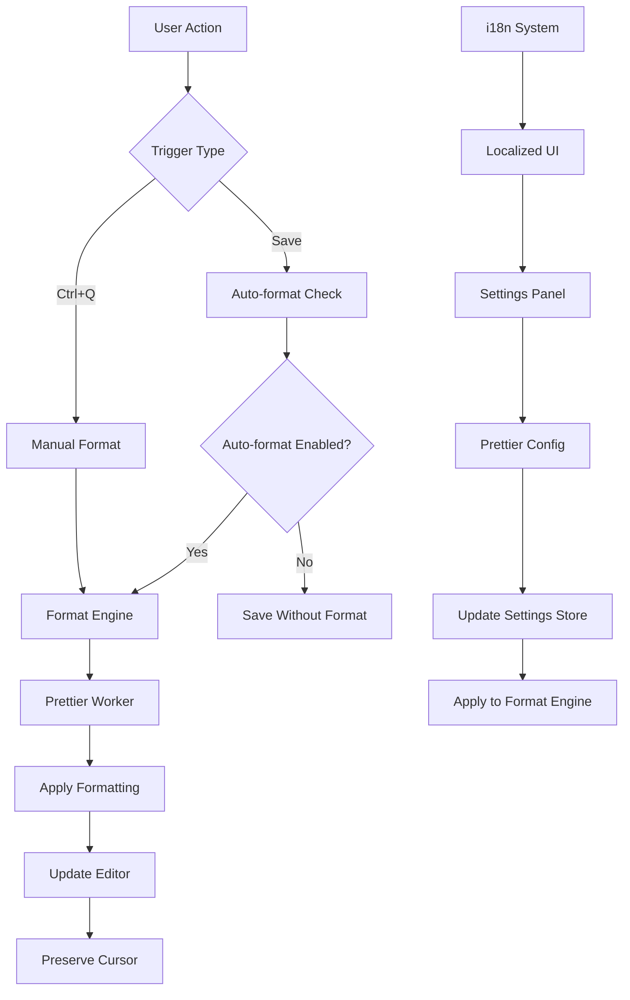

# Design Document: Prettier Integration

## Overview

This design document outlines the integration of Prettier code formatting into the Strudel live coding environment. The solution will extend the existing settings system and CodeMirror editor integration to provide automatic and manual code formatting capabilities with full internationalization support.

The integration leverages Strudel's existing architecture:
- Settings system using nanostores for persistence
- CodeMirror editor with extension system
- i18n system for multi-language support
- React-based settings UI components

## Architecture



## Components and Interfaces

### 1. Format Engine (`formatEngine.ts`)

The core formatting component that handles Prettier integration:

```typescript
interface FormatEngine {
  formatCode(code: string, options: PrettierOptions): Promise<FormatResult>;
  formatSelection(code: string, start: number, end: number, options: PrettierOptions): Promise<FormatResult>;
  validateSyntax(code: string): boolean;
}

interface FormatResult {
  success: boolean;
  formattedCode?: string;
  error?: string;
  cursorOffset?: number;
}

interface PrettierOptions {
  tabWidth: number;
  useTabs: boolean;
  semi: boolean;
  singleQuote: boolean;
  quoteProps: 'as-needed' | 'consistent' | 'preserve';
  trailingComma: 'none' | 'es5' | 'all';
  bracketSpacing: boolean;
  arrowParens: 'avoid' | 'always';
  printWidth: number;
}
```

### 2. Settings Extension

Extend the existing settings system to include Prettier configuration:

```typescript
// Addition to Settings interface
interface Settings {
  // ... existing settings
  isPrettierEnabled: boolean;
  prettierAutoFormatOnSave: boolean;
  prettierTabWidth: number;
  prettierUseTabs: boolean;
  prettierSemi: boolean;
  prettierSingleQuote: boolean;
  prettierQuoteProps: 'as-needed' | 'consistent' | 'preserve';
  prettierTrailingComma: 'none' | 'es5' | 'all';
  prettierBracketSpacing: boolean;
  prettierArrowParens: 'avoid' | 'always';
  prettierPrintWidth: number;
}
```

### 3. CodeMirror Extension (`prettierExtension.ts`)

A CodeMirror extension that integrates formatting capabilities:

```typescript
interface PrettierExtension {
  formatCommand: Command;
  autoFormatOnSave: Extension;
  formatKeymap: Extension;
}

interface Command {
  run(view: EditorView): boolean;
}
```

### 4. Settings UI Components

Extend the existing SettingsTab component with Prettier configuration:

```typescript
interface PrettierSettingsProps {
  settings: PrettierSettings;
  onChange: (key: string, value: any) => void;
  onPreview: (code: string) => string;
}

interface PrettierSettings {
  enabled: boolean;
  autoFormatOnSave: boolean;
  options: PrettierOptions;
}
```

## Data Models

### Prettier Configuration Store

```typescript
const defaultPrettierSettings = {
  isPrettierEnabled: false,
  prettierAutoFormatOnSave: false,
  prettierTabWidth: 2,
  prettierUseTabs: false,
  prettierSemi: true,
  prettierSingleQuote: false,
  prettierQuoteProps: 'as-needed',
  prettierTrailingComma: 'es5',
  prettierBracketSpacing: true,
  prettierArrowParens: 'always',
  prettierPrintWidth: 80,
};
```

### Format Request Model

```typescript
interface FormatRequest {
  code: string;
  selection?: {
    start: number;
    end: number;
  };
  options: PrettierOptions;
  preserveCursor: boolean;
}
```

## Correctness Properties

*A property is a characteristic or behavior that should hold true across all valid executions of a system-essentially, a formal statement about what the system should do. Properties serve as the bridge between human-readable specifications and machine-verifiable correctness guarantees.*

### Property 1: Core Formatting Consistency
*For any* valid JavaScript or TypeScript code, applying Prettier formatting should produce consistently formatted output that follows the configured style rules.
**Validates: Requirements 1.1**

### Property 2: Error Handling Preservation
*For any* invalid JavaScript or TypeScript code, formatting should return the original code unchanged and log appropriate error information.
**Validates: Requirements 1.2**

### Property 3: Cursor Position Preservation
*For any* code formatting operation, the cursor position should be preserved relative to the code structure after formatting completes.
**Validates: Requirements 1.3**

### Property 4: Language Support Completeness
*For any* JavaScript or TypeScript syntax construct, the Format_Engine should successfully parse and format the code according to language-specific rules.
**Validates: Requirements 1.4**

### Property 5: Auto-format Conditional Behavior
*For any* code save operation, formatting should occur if and only if auto-format on save is enabled in user settings.
**Validates: Requirements 2.1, 2.2**

### Property 6: Save Error Recovery
*For any* formatting failure during save, the system should save the original code and provide user notification.
**Validates: Requirements 2.3**

### Property 7: Settings Persistence Round-trip
*For any* formatting preference change, the setting should persist across browser sessions and be retrievable with the same value.
**Validates: Requirements 2.4, 4.4**

### Property 8: Keyboard Shortcut Formatting
*For any* editor state, pressing Ctrl+Q (Cmd+Q on Mac) should trigger formatting of the appropriate content (selection or full document).
**Validates: Requirements 3.1, 3.2, 3.3**

### Property 9: Visual Feedback Consistency
*For any* formatting operation, appropriate visual feedback should be provided during and after the operation.
**Validates: Requirements 3.4, 6.2, 6.3**

### Property 10: Settings Application Immediacy
*For any* formatting configuration change, subsequent formatting operations should immediately use the new settings.
**Validates: Requirements 4.3**

### Property 11: Internationalization Completeness
*For any* supported language, all Prettier-related UI text should be displayed in the selected language.
**Validates: Requirements 5.1, 5.2, 5.3, 5.4**

### Property 12: Error Notification Consistency
*For any* formatting failure, a non-intrusive error notification should be displayed with localized error messages.
**Validates: Requirements 6.1**

### Property 13: Error Logging Privacy
*For any* formatting error, debugging information should be logged while protecting user code privacy.
**Validates: Requirements 6.4**

### Property 14: Web Worker Usage for Large Files
*For any* code file exceeding performance thresholds, formatting should use web workers to prevent UI blocking.
**Validates: Requirements 7.2**

### Property 15: Request Debouncing
*For any* rapid sequence of formatting requests, the system should debounce to prevent performance degradation.
**Validates: Requirements 7.3**

### Property 16: Configuration Caching
*For any* Prettier configuration, the parsed configuration should be cached to avoid repeated parsing overhead.
**Validates: Requirements 7.4**

<function_calls>
<invoke name="prework">
<parameter name="featureName">prettier-integration

## Error Handling

### Format Engine Errors
- **Syntax Errors**: Return original code unchanged, log error details
- **Configuration Errors**: Fall back to default Prettier options, notify user
- **Performance Timeouts**: Cancel operation, return original code, show timeout message
- **Web Worker Failures**: Fall back to main thread formatting with performance warning

### Settings Errors
- **Invalid Configuration Values**: Validate and clamp to acceptable ranges
- **Storage Failures**: Use in-memory fallback, warn user about persistence issues
- **Migration Errors**: Reset to defaults if settings corruption detected

### UI Error States
- **Loading States**: Show spinner for operations > 200ms
- **Error Notifications**: Non-blocking toast messages with dismiss option
- **Fallback UI**: Graceful degradation if formatting features unavailable

## Testing Strategy

### Dual Testing Approach
The testing strategy employs both unit tests and property-based tests to ensure comprehensive coverage:

**Unit Tests**: Focus on specific examples, edge cases, and integration points
- Settings UI component behavior
- Error handling scenarios
- Keyboard shortcut registration
- i18n translation loading

**Property-Based Tests**: Verify universal properties across all inputs
- Code formatting consistency across random valid JavaScript/TypeScript
- Cursor position preservation with various code structures
- Settings persistence across different configuration combinations
- Error handling with randomly generated invalid code

### Property-Based Testing Configuration
- **Framework**: fast-check for JavaScript property-based testing
- **Iterations**: Minimum 100 iterations per property test
- **Test Tagging**: Each property test tagged with format: **Feature: prettier-integration, Property {number}: {property_text}**
- **Code Generation**: Smart generators for valid/invalid JavaScript and TypeScript code
- **Settings Generation**: Generators for all valid Prettier configuration combinations

### Integration Testing
- **CodeMirror Integration**: Test formatting commands within editor context
- **Settings Panel Integration**: Test UI updates reflect in formatting behavior
- **i18n Integration**: Test language switching affects all Prettier UI elements
- **Performance Testing**: Verify web worker usage and debouncing behavior

### Test Environment Setup
- **Browser Testing**: Test in multiple browsers for CodeMirror compatibility
- **Web Worker Testing**: Verify worker-based formatting in supported environments
- **Storage Testing**: Test settings persistence across browser sessions
- **Accessibility Testing**: Ensure settings UI meets accessibility standards

## Implementation Notes

### Dependencies
- **prettier**: Core formatting library (already in project)
- **@codemirror/commands**: For keyboard shortcut integration
- **comlink**: For web worker communication (if not already available)

### Performance Considerations
- **Lazy Loading**: Load Prettier worker only when formatting is first used
- **Configuration Caching**: Cache parsed Prettier config to avoid repeated parsing
- **Debouncing**: Debounce rapid formatting requests (300ms default)
- **Size Thresholds**: Use web workers for files > 1000 lines

### Browser Compatibility
- **Web Workers**: Graceful fallback to main thread if workers unavailable
- **Local Storage**: Handle quota exceeded errors gracefully
- **Keyboard Events**: Cross-platform key combination handling (Ctrl vs Cmd)

### Security Considerations
- **Code Privacy**: Ensure user code never leaves the browser
- **Error Logging**: Sanitize error logs to remove sensitive code content
- **Settings Validation**: Validate all user input to prevent injection attacks