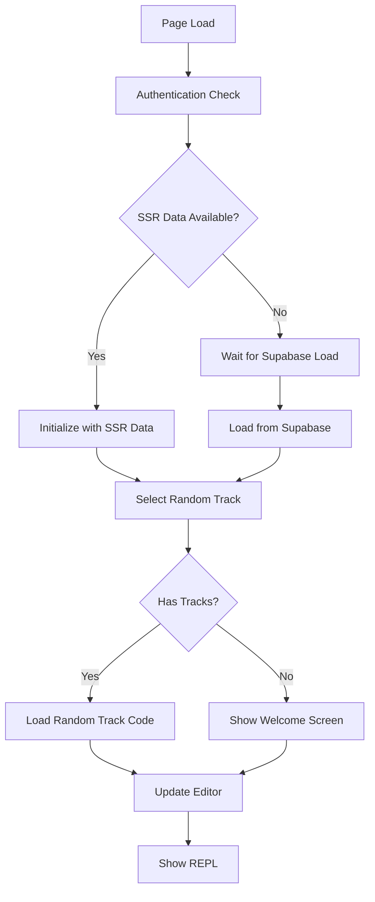

# Design Document: Random Track Loading Fix

## Overview

This design addresses the race condition where the REPL loads default code instead of random tracks for authenticated users. The solution involves coordinating authentication, track loading, and editor initialization to ensure users see their content when available.

## Architecture

The fix involves three main components working together:

1. **Enhanced Tracks Store**: Improved initialization and random track selection logic
2. **Coordinated Loading Manager**: Orchestrates authentication, track loading, and editor updates
3. **Smart Editor Initialization**: Waits for data availability before showing content



## Components and Interfaces

### 1. Enhanced Tracks Store (`tracksStore.ts`)

**New Methods:**
```typescript
interface TracksActions {
  // Existing methods...
  selectRandomTrack(): Track | null;
  initializeWithCoordination(ssrData: any, onComplete: (randomTrack: Track | null) => void): void;
  waitForInitialization(): Promise<{ hasData: boolean; randomTrack: Track | null }>;
}
```

**Enhanced State:**
```typescript
interface TracksState {
  // Existing fields...
  initializationPromise: Promise<void> | null;
  randomTrackSelected: boolean;
  loadingPhase: 'initial' | 'loading' | 'complete' | 'error';
}
```

### 2. Loading Coordination Manager (`loadingCoordinator.ts`)

```typescript
interface LoadingCoordinator {
  coordinateInitialLoad(context: {
    ssrData?: any;
    isAuthenticated: boolean;
    fileManagerHook?: any;
  }): Promise<LoadingResult>;
}

interface LoadingResult {
  success: boolean;
  randomTrack: Track | null;
  shouldShowDefault: boolean;
  reason: string;
}
```

### 3. Enhanced ReplEditor Component

**New Loading States:**
- `waiting-for-auth`: Authentication in progress
- `waiting-for-tracks`: Tracks loading from Supabase
- `selecting-random`: Random track selection in progress
- `loading-track`: Selected track code loading
- `ready`: Editor ready with content

## Data Models

### Enhanced Track Selection Logic

```typescript
interface RandomTrackSelector {
  selectRandom(tracks: Record<string, Track>, excludeIds?: string[]): Track | null;
  getSelectionCriteria(): {
    preferRecent: boolean;
    excludeEmpty: boolean;
    weightByModified: boolean;
  };
}
```

### Loading State Management

```typescript
interface LoadingState {
  phase: 'initial' | 'auth-check' | 'data-load' | 'track-select' | 'complete';
  progress: number; // 0-100
  message: string;
  error?: string;
  startTime: number;
  timeout: number; // 5000ms default
}
```

## Correctness Properties

*A property is a characteristic or behavior that should hold true across all valid executions of a system-essentially, a formal statement about what the system should do. Properties serve as the bridge between human-readable specifications and machine-verifiable correctness guarantees.*

### Property 1: Authentication-Aware Loading
*For any* page load with valid authentication and available tracks, the system should load a random track instead of default code
**Validates: Requirements 1.1, 1.2**

### Property 2: Race Condition Prevention
*For any* concurrent authentication and track loading operations, only one random track selection should occur and complete successfully
**Validates: Requirements 2.1, 2.4**

### Property 3: Fallback Consistency
*For any* scenario where tracks are unavailable (no tracks, auth failure, timeout), the system should show default code with appropriate messaging
**Validates: Requirements 3.1, 3.2, 3.3**

### Property 4: State Synchronization
*For any* track loading operation, both the tracks store and file manager should reflect the same final state
**Validates: Requirements 5.1, 5.2, 5.3**

### Property 5: Timeout Compliance
*For any* track loading operation, the system should complete within 5 seconds or fall back to default code
**Validates: Requirements 4.3, 4.4**

### Property 6: SSR Data Priority
*For any* page load with SSR data, the system should use SSR data for immediate track selection without additional API calls
**Validates: Requirements 4.1, 1.3**

## Error Handling

### Timeout Handling
- **Authentication timeout**: 3 seconds → show default code
- **Track loading timeout**: 5 seconds → show default code with error message
- **Random selection timeout**: 1 second → show default code

### Network Error Handling
- **Supabase connection failure**: Retry once, then fall back to default code
- **API rate limiting**: Show appropriate message and fall back
- **Session expiry during load**: Redirect to login

### Data Consistency Errors
- **SSR/API data mismatch**: Prefer API data and log warning
- **Corrupted track data**: Skip corrupted tracks in random selection
- **Missing track code**: Fall back to default code

## Testing Strategy

### Unit Tests
- Test random track selection with various track sets
- Test timeout handling for each loading phase
- Test error scenarios (network failures, corrupted data)
- Test state synchronization between stores

### Property-Based Tests
- **Property 1 Test**: Generate random authentication states and track sets, verify correct loading behavior
- **Property 2 Test**: Simulate concurrent operations, verify no race conditions occur
- **Property 3 Test**: Generate various failure scenarios, verify consistent fallback behavior
- **Property 4 Test**: Generate random track operations, verify store synchronization
- **Property 5 Test**: Generate random loading scenarios, verify timeout compliance
- **Property 6 Test**: Generate various SSR data configurations, verify priority handling

### Integration Tests
- Test complete page load flow with authentication
- Test SSR data initialization path
- Test Supabase fallback path
- Test error recovery scenarios

### Performance Tests
- Measure time from page load to track display
- Test with large numbers of tracks (100+)
- Test with slow network conditions
- Verify memory usage during loading

Each property test should run minimum 100 iterations and be tagged with:
**Feature: random-track-loading-fix, Property {number}: {property_text}**