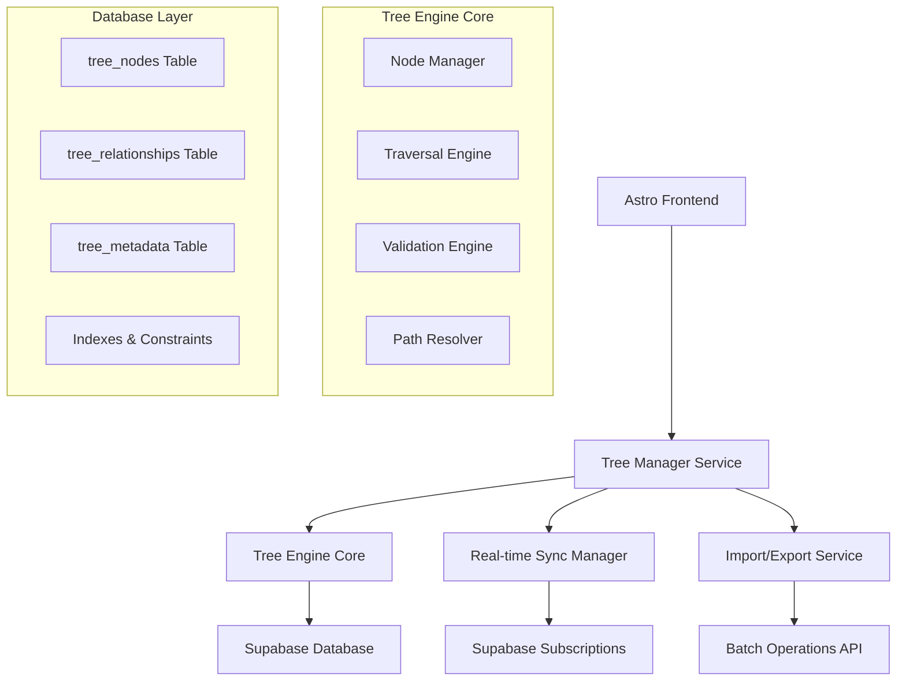

# Scalable Tree-Based File System Design

## Overview

This design implements a high-performance, scalable tree-based file system for Strudel that supports arbitrary hierarchical structures. The system uses advanced tree algorithms, optimized database schemas, and real-time synchronization to handle millions of nodes while maintaining data integrity and performance.

## Architecture

### Core Components



### System Layers

1. **Presentation Layer**: Astro components for tree visualization and interaction
2. **Service Layer**: Tree Manager orchestrating all tree operations
3. **Core Engine**: Advanced tree algorithms and data structures
4. **Persistence Layer**: Optimized Supabase schema with proper indexing
5. **Synchronization Layer**: Real-time updates and conflict resolution

## Components and Interfaces

### Tree Node Interface

```typescript
interface TreeNode {
  id: string;                    // UUID - unique identifier
  name: string;                  // Display name (allows duplicates)
  type: 'folder' | 'track';      // Node type
  parentId: string | null;       // Parent node reference
  userId: string;                // Owner identifier
  created: string;               // ISO timestamp
  modified: string;              // ISO timestamp
  metadata: NodeMetadata;        // Additional properties
  
  // Computed properties (not stored)
  path?: string;                 // Full hierarchical path
  depth?: number;                // Distance from root
  childCount?: number;           // Number of direct children
}

interface TrackNode extends TreeNode {
  type: 'track';
  code: string;                  // Strudel code content
  isMultitrack: boolean;         // Multitrack flag
  steps?: TrackStep[];           // Multitrack steps
  activeStep: number;            // Current active step
}

interface FolderNode extends TreeNode {
  type: 'folder';
  // Folders have no additional properties
}

interface NodeMetadata {
  tags?: string[];               // User-defined tags
  color?: string;                // UI color hint
  description?: string;          // User description
  customProperties?: Record<string, any>; // Extensible metadata
}
```

### Tree Manager Service

```typescript
class TreeManager {
  private engine: TreeEngine;
  private syncManager: SyncManager;
  private importExport: ImportExportService;
  
  // Core Operations
  async createNode(node: Partial<TreeNode>): Promise<TreeNode>;
  async updateNode(id: string, updates: Partial<TreeNode>): Promise<TreeNode>;
  async deleteNode(id: string, cascade: boolean = true): Promise<void>;
  async moveNode(nodeId: string, newParentId: string | null): Promise<void>;
  
  // Tree Navigation
  async getNode(id: string): Promise<TreeNode | null>;
  async getChildren(parentId: string | null): Promise<TreeNode[]>;
  async getParent(nodeId: string): Promise<TreeNode | null>;
  async getPath(nodeId: string): Promise<string>;
  async getSubtree(rootId: string, maxDepth?: number): Promise<TreeNode[]>;
  
  // Search and Query
  async searchNodes(query: SearchQuery): Promise<TreeNode[]>;
  async findByPath(path: string): Promise<TreeNode | null>;
  async findByPattern(pattern: string): Promise<TreeNode[]>;
  
  // Validation
  async validateTree(): Promise<ValidationResult>;
  async detectCycles(): Promise<string[]>;
  async findOrphans(): Promise<TreeNode[]>;
  
  // Statistics
  async getTreeStats(): Promise<TreeStatistics>;
  async getNodeStats(nodeId: string): Promise<NodeStatistics>;
}
```

### Tree Engine Core

```typescript
class TreeEngine {
  private nodes: Map<string, TreeNode>;
  private children: Map<string, Set<string>>;
  private parents: Map<string, string>;
  private pathCache: Map<string, string>;
  
  // Graph Operations
  addNode(node: TreeNode): void;
  removeNode(nodeId: string): void;
  updateParent(nodeId: string, newParentId: string | null): void;
  
  // Traversal Algorithms
  depthFirstTraversal(rootId: string, visitor: NodeVisitor): void;
  breadthFirstTraversal(rootId: string, visitor: NodeVisitor): void;
  postOrderTraversal(rootId: string, visitor: NodeVisitor): void;
  
  // Path Operations
  computePath(nodeId: string): string;
  resolvePath(path: string): string | null;
  invalidatePathCache(nodeId: string): void;
  
  // Validation
  validateHierarchy(): ValidationResult[];
  detectCycle(nodeId: string): boolean;
  findOrphanedNodes(): string[];
}
```

## Data Models

### Database Schema

```sql
-- Main nodes table with optimized structure
CREATE TABLE tree_nodes (
  id TEXT PRIMARY KEY,
  user_id UUID REFERENCES auth.users(id) ON DELETE CASCADE NOT NULL,
  name TEXT NOT NULL,
  type TEXT NOT NULL CHECK (type IN ('folder', 'track')),
  parent_id TEXT REFERENCES tree_nodes(id) ON DELETE CASCADE,
  created TEXT NOT NULL,
  modified TEXT NOT NULL,
  
  -- Track-specific fields
  code TEXT,
  is_multitrack BOOLEAN DEFAULT FALSE,
  steps JSONB,
  active_step INTEGER DEFAULT 0,
  
  -- Metadata
  metadata JSONB DEFAULT '{}',
  
  -- Materialized path for fast queries (optional)
  path_array TEXT[],
  depth INTEGER,
  
  -- Timestamps
  created_at TIMESTAMP WITH TIME ZONE DEFAULT NOW(),
  updated_at TIMESTAMP WITH TIME ZONE DEFAULT NOW()
);

-- Optimized indexes for tree operations
CREATE INDEX idx_tree_nodes_user_id ON tree_nodes(user_id);
CREATE INDEX idx_tree_nodes_parent_id ON tree_nodes(parent_id);
CREATE INDEX idx_tree_nodes_type ON tree_nodes(type);
CREATE INDEX idx_tree_nodes_user_parent ON tree_nodes(user_id, parent_id);
CREATE INDEX idx_tree_nodes_path_array ON tree_nodes USING GIN(path_array);
CREATE INDEX idx_tree_nodes_depth ON tree_nodes(depth);
CREATE INDEX idx_tree_nodes_name ON tree_nodes(name);

-- Adjacency list optimization table (for very large trees)
CREATE TABLE tree_relationships (
  ancestor_id TEXT REFERENCES tree_nodes(id) ON DELETE CASCADE,
  descendant_id TEXT REFERENCES tree_nodes(id) ON DELETE CASCADE,
  depth INTEGER NOT NULL,
  PRIMARY KEY (ancestor_id, descendant_id)
);

CREATE INDEX idx_tree_rel_ancestor ON tree_relationships(ancestor_id);
CREATE INDEX idx_tree_rel_descendant ON tree_relationships(descendant_id);
CREATE INDEX idx_tree_rel_depth ON tree_relationships(depth);

-- Tree metadata and statistics
CREATE TABLE tree_metadata (
  user_id UUID REFERENCES auth.users(id) ON DELETE CASCADE PRIMARY KEY,
  total_nodes INTEGER DEFAULT 0,
  max_depth INTEGER DEFAULT 0,
  last_modified TIMESTAMP WITH TIME ZONE DEFAULT NOW(),
  statistics JSONB DEFAULT '{}'
);
```

### Tree Statistics Model

```typescript
interface TreeStatistics {
  totalNodes: number;
  totalFolders: number;
  totalTracks: number;
  maxDepth: number;
  averageDepth: number;
  nodesPerLevel: number[];
  largestSubtree: {
    nodeId: string;
    size: number;
  };
  duplicateNames: {
    name: string;
    count: number;
    nodes: string[];
  }[];
}

interface NodeStatistics {
  nodeId: string;
  subtreeSize: number;
  depth: number;
  childCount: number;
  descendantCount: number;
  pathLength: number;
}
```

## Correctness Properties

*A property is a characteristic or behavior that should hold true across all valid executions of a system-essentially, a formal statement about what the system should do. Properties serve as the bridge between human-readable specifications and machine-verifiable correctness guarantees.*

### Property Reflection

After analyzing all acceptance criteria, I identified several areas where properties can be consolidated:

- **Node Creation Properties**: Properties 1, 2, and 3 all relate to node creation and can be combined into comprehensive creation tests
- **Tree Integrity Properties**: Properties 4, 5, and 6 all test different aspects of tree integrity and can be unified
- **Operation Atomicity**: Properties 7, 8, and 9 test atomic operations and can be combined
- **Traversal Properties**: Properties 10 and 11 test different traversal methods but can be unified under traversal correctness

### Core Properties

**Property 1: Node Creation and Naming Integrity**
*For any* valid node name and parent ID, creating a node should result in a unique node with the exact name preserved and proper parent relationship established
**Validates: Requirements 1.1, 1.3, 1.4**

**Property 2: Tree Structure Consistency**
*For any* tree operation (create, move, delete), the resulting tree should maintain valid parent-child relationships without cycles or orphans
**Validates: Requirements 1.2, 3.1, 3.3**

**Property 3: Path Generation Accuracy**
*For any* node in the tree, the generated path should correctly represent the hierarchical structure from root to that node
**Validates: Requirements 1.5**

**Property 4: Atomic Operation Integrity**
*For any* tree modification operation, either all changes are applied successfully or no changes are applied at all
**Validates: Requirements 2.2, 3.4, 4.1**

**Property 5: Search and Traversal Completeness**
*For any* search criteria or traversal method, all matching nodes should be found and visited in the correct order
**Validates: Requirements 2.4, 6.1, 6.2, 6.3, 6.4**

**Property 6: Deletion Cascade Correctness**
*For any* node deletion, child nodes should be handled according to the specified cascade rules consistently
**Validates: Requirements 3.2**

**Property 7: Data Repair Functionality**
*For any* detected orphaned nodes, the repair mechanism should successfully restore tree integrity
**Validates: Requirements 3.5**

**Property 8: Import/Export Round Trip**
*For any* tree structure, exporting and then importing should result in an identical tree with all relationships preserved
**Validates: Requirements 4.2, 4.5**

**Property 9: Conflict Resolution Consistency**
*For any* import operation with conflicts, the resolution strategy should be applied consistently across all conflicts
**Validates: Requirements 4.4**

**Property 10: Real-time Synchronization Accuracy**
*For any* tree modification, all active sessions should receive the update and maintain consistent tree state
**Validates: Requirements 5.1, 5.5**

**Property 11: Concurrent Operation Consistency**
*For any* set of concurrent tree operations, the final state should be equivalent to some sequential execution of those operations
**Validates: Requirements 5.2**

**Property 12: Offline Synchronization Completeness**
*For any* operations performed while offline, reconnection should result in all operations being synchronized without data loss
**Validates: Requirements 5.3, 5.4**

**Property 13: Tree Statistics Accuracy**
*For any* tree structure, calculated statistics should accurately reflect the actual tree properties
**Validates: Requirements 6.5**

**Property 14: Authentication Integration**
*For any* tree operation, user authentication should be properly validated and user isolation maintained
**Validates: Requirements 8.2**

## Error Handling

### Error Categories

1. **Validation Errors**: Invalid node data, circular references, constraint violations
2. **Concurrency Errors**: Optimistic locking failures, transaction conflicts
3. **Network Errors**: Connection failures, timeout errors, subscription interruptions
4. **Database Errors**: Constraint violations, foreign key errors, transaction failures
5. **Business Logic Errors**: Invalid operations, permission denied, quota exceeded

### Error Recovery Strategies

```typescript
interface ErrorRecoveryStrategy {
  retryable: boolean;
  maxRetries: number;
  backoffStrategy: 'linear' | 'exponential' | 'fixed';
  fallbackAction?: () => Promise<void>;
  userNotification: boolean;
}

class ErrorHandler {
  async handleError(error: TreeError): Promise<void> {
    const strategy = this.getRecoveryStrategy(error.type);
    
    if (strategy.retryable && error.retryCount < strategy.maxRetries) {
      await this.retryWithBackoff(error, strategy);
    } else if (strategy.fallbackAction) {
      await strategy.fallbackAction();
    }
    
    if (strategy.userNotification) {
      this.notifyUser(error);
    }
  }
}
```

## Testing Strategy

### Dual Testing Approach

The system will use both unit testing and property-based testing for comprehensive coverage:

**Unit Testing**:
- Specific examples demonstrating correct behavior
- Edge cases and error conditions
- Integration points between components
- Authentication and authorization flows

**Property-Based Testing**:
- Universal properties that should hold across all inputs
- Tree integrity and consistency properties
- Performance characteristics under various loads
- Concurrent operation safety

**Property-Based Testing Framework**: We will use **fast-check** for JavaScript/TypeScript property-based testing, configured to run a minimum of 100 iterations per property test.

Each property-based test will be tagged with comments explicitly referencing the correctness property from this design document using the format: **Feature: scalable-tree-filesystem, Property {number}: {property_text}**

**Testing Requirements**:
- Each correctness property must be implemented by a single property-based test
- Property tests must run at least 100 iterations to ensure statistical confidence
- Unit tests complement property tests by covering specific scenarios and edge cases
- All tests must validate both functional correctness and performance characteristics

### Test Categories

1. **Tree Structure Tests**: Validate tree integrity, cycle detection, orphan handling
2. **Operation Tests**: Test CRUD operations, moves, batch operations
3. **Concurrency Tests**: Validate thread safety and transaction isolation
4. **Performance Tests**: Ensure O(log n) complexity for key operations
5. **Integration Tests**: Test Supabase integration and real-time synchronization
6. **UI Tests**: Validate frontend tree rendering and interaction

## Performance Considerations

### Optimization Strategies

1. **Indexed Queries**: All tree traversal operations use database indexes
2. **Path Caching**: Frequently accessed paths are cached in memory
3. **Lazy Loading**: Large subtrees are loaded on demand
4. **Batch Operations**: Multiple operations are grouped into transactions
5. **Connection Pooling**: Database connections are efficiently managed

### Scalability Targets

- **Node Capacity**: Support for 10+ million nodes per user
- **Operation Latency**: < 100ms for single node operations
- **Batch Operations**: Process 10,000+ nodes in < 5 seconds
- **Concurrent Users**: Support 1,000+ simultaneous users
- **Real-time Updates**: < 50ms propagation delay

This design provides a robust, scalable foundation for complex hierarchical file structures while maintaining excellent performance and data integrity.