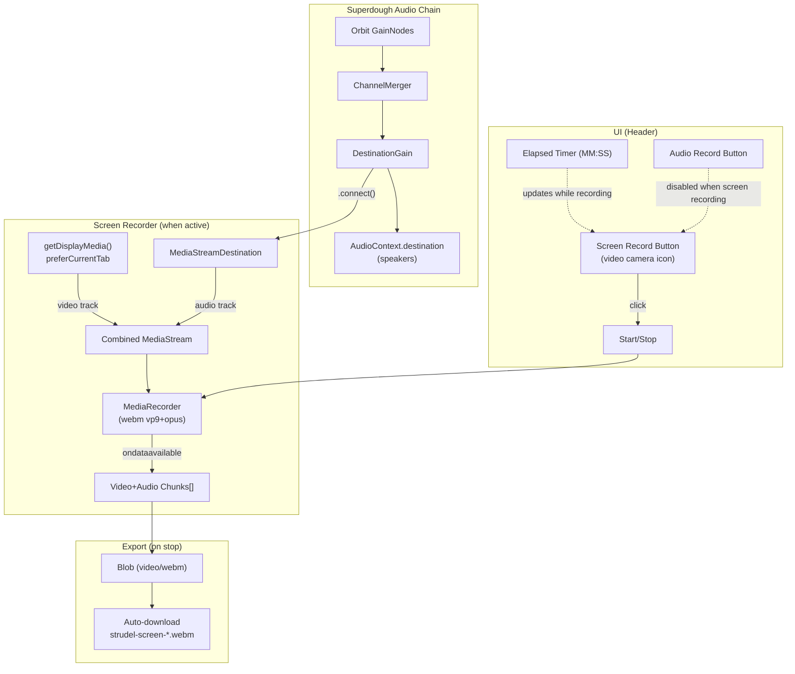
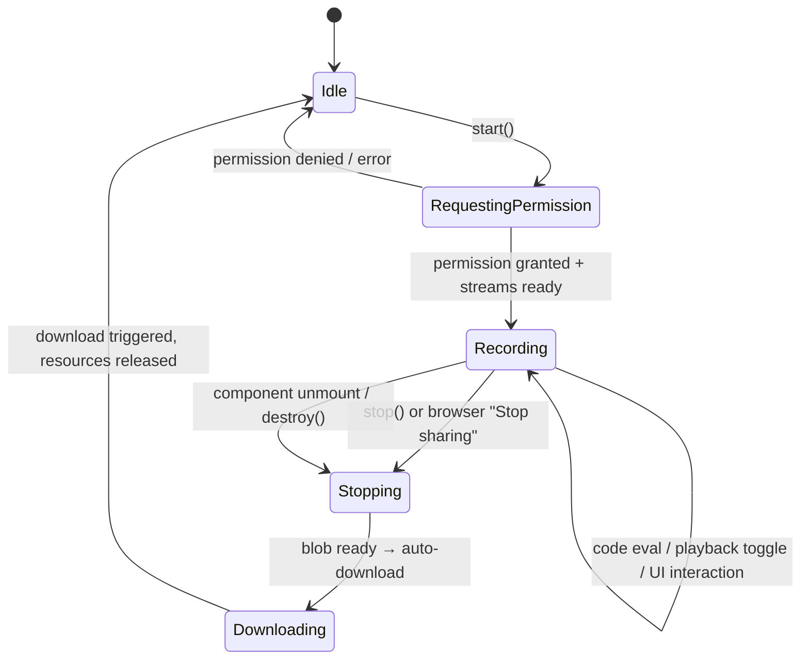

# Design Document: Screen Recorder

## Overview

The Screen Recorder feature captures a video recording of the entire browser tab — including Hydra visuals, @strudel/draw canvas animations, the code editor, and all UI — combined with the live audio output from the Strudel audio pipeline. It produces a WebM file (VP9 video + Opus audio) that users can download and share.

The feature mirrors the architecture of the existing audio-only recorder (`AudioRecorderEngine` + `useAudioRecorder`) but adds a video track from the Screen Capture API (`getDisplayMedia`) and merges it with the audio track into a single `MediaRecorder` session.

### Key Design Decisions

1. **Parallel engine, not extension of AudioRecorderEngine** — The screen recorder has fundamentally different concerns (video track acquisition, permission prompts, combined streams, external stop events from browser "Stop sharing" UI). A separate `ScreenRecorderEngine` class keeps both engines simple and independently testable. Shared utilities (`formatElapsedTime`, `generateFilename`) are reused from `recording/formatUtils.ts`.

2. **Same audio tap point: DestinationGain** — Like the audio recorder, the screen recorder connects a `MediaStreamDestination` to `SuperdoughOutput.destinationGain` to capture all mixed audio. This is non-destructive — the main audio output to speakers is unaffected.

3. **No export dialog — direct WebM download** — Unlike the audio recorder which offers WAV/MP3 format choice, the screen recorder produces WebM natively from `MediaRecorder`. No transcoding step is needed, so the file downloads automatically when recording stops.

4. **Mutual exclusion at the hook level** — Both `useAudioRecorder` and `useScreenRecorder` share their `isRecording` state through `useReplContext`. The screen recorder hook checks the audio recorder's state before starting (and vice versa), enforcing mutual exclusion without coupling the engine classes.

5. **`preferCurrentTab` hint** — The `getDisplayMedia({ preferCurrentTab: true })` option biases the browser's picker toward the current tab, reducing friction for the user. If the browser doesn't support this hint, it falls back to the standard tab/window picker.

6. **Website-level module** — Like the audio recorder, this lives in `website/src/repl/` since it's UI-coupled and only used in the website.

## Architecture



### Integration Points

1. **SuperdoughOutput.destinationGain** — accessed via `getSuperdoughAudioController().output.destinationGain`. The screen recorder connects/disconnects its `MediaStreamDestination` to this node, same pattern as the audio recorder.

2. **Header component** (`website/src/repl/components/Header.tsx`) — receives screen recorder state via `ReplContext` and renders the screen record button + elapsed time. The button is hidden when `getDisplayMedia` is not supported.

3. **useReplContext** (`website/src/repl/useReplContext.tsx`) — instantiates `useScreenRecorder`, passes the audio recorder's `isRecording` state for mutual exclusion, and exposes screen recording state/handlers to the context.

4. **Existing formatUtils** (`website/src/repl/recording/formatUtils.ts`) — `formatElapsedTime` is reused for the elapsed time display. A new `generateScreenFilename` function (or extension of `generateFilename`) produces the `strudel-screen-*` filename pattern.

## Components and Interfaces

### ScreenRecorderEngine

Core recording engine class. Lives at `website/src/repl/recording/ScreenRecorderEngine.ts`.

```typescript
interface ScreenRecorderState {
  isRecording: boolean;
  elapsedSeconds: number;
  error: string | null;
}

interface ScreenRecorderCallbacks {
  onStateChange?: (state: ScreenRecorderState) => void;
  onExternalStop?: () => void; // fired when browser "Stop sharing" ends the stream
}

class ScreenRecorderEngine {
  constructor(audioContext: AudioContext, callbacks?: ScreenRecorderCallbacks);

  /** Request tab capture, connect audio, create combined MediaRecorder, start */
  start(destinationGain: GainNode): Promise<void>;

  /** Stop MediaRecorder, stop all tracks, disconnect nodes, return WebM blob */
  stop(): Promise<Blob>;

  /** Get current state */
  getState(): ScreenRecorderState;

  /** Release all resources */
  destroy(): Promise<void>;

  /** Check if Screen Capture API is available */
  static isSupported(): boolean;
}
```

### useScreenRecorder Hook

React hook managing the `ScreenRecorderEngine` lifecycle. Lives at `website/src/repl/recording/useScreenRecorder.ts`.

```typescript
interface UseScreenRecorderReturn {
  isScreenRecording: boolean;
  screenRecordingElapsedSeconds: number;
  handleScreenRecordToggle: () => void;
  screenRecordingError: string | null;
  isScreenRecordingSupported: boolean;
}

function useScreenRecorder(
  isAudioRecording: boolean  // from useAudioRecorder, for mutual exclusion
): UseScreenRecorderReturn;
```

### Header Integration

The Header component receives these additional props via `ReplContext`:

```typescript
// Added to ReplContext interface
interface ReplContext {
  // ... existing fields ...
  isScreenRecording?: boolean;
  screenRecordingElapsedSeconds?: number;
  handleScreenRecordToggle?: () => void;
  isScreenRecordingSupported?: boolean;
}
```

The screen record button renders next to the existing audio record button. It uses a video camera icon (from Heroicons) and shows the same `recording-pulse` CSS animation and `formatElapsedTime` display when active.

### formatUtils Extension

A new function in `website/src/repl/recording/formatUtils.ts`:

```typescript
/** Generates filename: "strudel-screen-YYYY-MM-DD-HHmmss.webm" */
function generateScreenFilename(date: Date): string;
```

This follows the same pattern as `generateFilename` but uses the `strudel-screen-` prefix and always produces `.webm`.

## Data Models

### Video+Audio Chunk Storage

```typescript
// Internal to ScreenRecorderEngine
interface ScreenChunkStore {
  chunks: Blob[];           // Incremental webm chunks from MediaRecorder
  totalBytes: number;       // Running byte count
  startTime: number;        // Date.now() when recording started
}
```

### Screen Recording State Flow



### Combined Stream Construction

```typescript
// Pseudocode for stream merging inside ScreenRecorderEngine.start()
const tabStream = await navigator.mediaDevices.getDisplayMedia({
  video: { displaySurface: 'browser' },
  preferCurrentTab: true,
  audio: false,  // We capture audio from DestinationGain, not system audio
});

const mediaStreamDest = audioContext.createMediaStreamDestination();
destinationGain.connect(mediaStreamDest);

const combinedStream = new MediaStream([
  ...tabStream.getVideoTracks(),
  ...mediaStreamDest.stream.getAudioTracks(),
]);

const recorder = new MediaRecorder(combinedStream, {
  mimeType: 'video/webm;codecs=vp9,opus',  // fallback chain handled
  videoBitsPerSecond: 2_500_000,
});
```


## Correctness Properties

*A property is a characteristic or behavior that should hold true across all valid executions of a system — essentially, a formal statement about what the system should do. Properties serve as the bridge between human-readable specifications and machine-verifiable correctness guarantees.*

### Property 1: Error handling on invalid preconditions

*For any* attempt to start a screen recording when preconditions are not met (AudioContext state is not "running", or `getDisplayMedia` rejects with a permission error), the engine should transition to an error state with a non-empty error message and `isRecording` should remain `false`.

**Validates: Requirements 1.3, 2.4**

### Property 2: Recording toggle round-trip

*For any* `ScreenRecorderEngine` in idle state (isRecording=false), calling `start()` with valid preconditions should transition it to recording (isRecording=true). For any engine in recording state, calling `stop()` should transition it back to idle (isRecording=false) and produce a non-empty Blob.

**Validates: Requirements 4.2, 4.3**

### Property 3: Combined stream composition

*For any* valid tab capture stream (with at least one video track) and any valid MediaStreamDestination (with at least one audio track), the combined MediaStream constructed by the engine should contain exactly one video track and exactly one audio track.

**Validates: Requirements 2.2, 3.1**

### Property 4: MIME type fallback selection

*For any* combination of browser-supported MIME types (where `MediaRecorder.isTypeSupported` returns true/false for each candidate), the engine should select the highest-priority supported MIME type from the ordered list: `video/webm;codecs=vp9,opus` → `video/webm;codecs=vp8,opus` → `video/webm`. If none are supported, the engine should report an error.

**Validates: Requirements 3.2**

### Property 5: Incremental chunk collection

*For any* sequence of `BlobEvent` data chunks emitted by the MediaRecorder's `ondataavailable` event during an active recording, the engine's internal chunk store should contain all chunks in order, and `totalBytes` should equal the sum of all chunk sizes.

**Validates: Requirements 3.4**

### Property 6: Recording persistence across UI actions

*For any* active screen recording session and any external UI action (code evaluation, playback toggle, file manager open/close, track navigation, settings panel open/close), the engine's `isRecording` state should remain `true` and the MediaRecorder state should remain `"recording"`.

**Validates: Requirements 5.1, 5.2, 7.1, 7.2, 7.3**

### Property 7: External stop handling

*For any* active screen recording session, when the tab capture stream's video track fires an `"ended"` event (browser "Stop sharing" control), the engine should automatically stop the recording, produce a valid Blob, and transition to idle state (isRecording=false).

**Validates: Requirements 4.6**

### Property 8: Blob assembly on stop

*For any* non-empty sequence of captured data chunks, calling `stop()` should produce a single Blob whose size is greater than zero and whose type starts with `"video/webm"`.

**Validates: Requirements 6.1**

### Property 9: Screen filename generation

*For any* `Date` object, the `generateScreenFilename` function should produce a string matching the pattern `strudel-screen-YYYY-MM-DD-HHmmss.webm` where all date components are zero-padded and derived from the input Date.

**Validates: Requirements 6.2**

### Property 10: Resource cleanup after recording

*For any* completed screen recording session, after `stop()` resolves: all video tracks on the tab capture stream should have `readyState === "ended"`, the MediaStreamDestination should be disconnected from the DestinationGain, and the internal chunk store should be empty (chunks.length === 0, totalBytes === 0).

**Validates: Requirements 9.1, 9.2, 9.3, 9.4**

## Error Handling

| Scenario | Handling |
|---|---|
| `getDisplayMedia` not supported | `ScreenRecorderEngine.isSupported()` returns `false`. The `useScreenRecorder` hook sets `isScreenRecordingSupported = false`. The Header hides the screen record button entirely. |
| User denies screen capture permission | `start()` catches the `NotAllowedError` from `getDisplayMedia`, sets error state: "Screen capture permission is required to record. Please allow access and try again.", and does not create a MediaRecorder. |
| AudioContext not running (suspended/closed) | `start()` checks `audioContext.state` before calling `getDisplayMedia`. If not `"running"`, sets error: "Audio playback must be active before screen recording. Press play first." |
| Audio recorder already active (mutual exclusion) | `useScreenRecorder` checks `isAudioRecording` before starting. If true, sets error: "Cannot start screen recording while audio recording is active." The Header also disables the button with a tooltip. |
| Screen recorder already active (mutual exclusion) | `useAudioRecorder`'s toggle checks `isScreenRecording` (passed via context). If true, sets error: "Cannot start audio recording while screen recording is active." |
| Browser "Stop sharing" ends the stream | The engine listens for the video track's `"ended"` event. When fired, it calls `stop()` internally, assembles the blob, triggers download, and transitions to idle. |
| Empty recording (zero chunks) | `stop()` checks if chunks array is empty. If so, the hook sets a warning: "Screen recording was empty — nothing to export." and skips the download. |
| MediaRecorder constructor failure | `start()` catches the error, cleans up the tab capture stream and audio nodes, and sets error state with the failure message. |
| MediaRecorder `onerror` event | Stops recording, sets error state, attempts to salvage any chunks already captured into a downloadable blob. |
| No supported video/webm MIME type | `start()` tries the fallback chain. If none are supported, sets error: "Your browser does not support WebM video recording." and cleans up. |
| Component unmount during recording | `useScreenRecorder`'s cleanup effect calls `engine.destroy()`, which stops the recording, stops all tracks, disconnects nodes, and releases chunks. |

## Testing Strategy

### Property-Based Testing

Use **fast-check** as the property-based testing library (compatible with Vitest, the project's test runner).

Each correctness property maps to a single property-based test with a minimum of 100 iterations. Tests are tagged with the format:

```
Feature: screen-recorder, Property {N}: {property title}
```

Property tests focus on:
- **Property 1**: Generate random error conditions (various AudioContext states, various DOMException types from getDisplayMedia rejection), verify engine always transitions to error state without recording.
- **Property 2**: Generate random valid start/stop sequences with mocked streams, verify state transitions follow idle → recording → idle and a non-empty blob is produced.
- **Property 3**: Generate random numbers of video/audio tracks in mock streams, verify the combined stream always has exactly 1 video + 1 audio track.
- **Property 4**: Generate random boolean combinations for isTypeSupported results across the three MIME candidates, verify the engine selects the correct highest-priority option.
- **Property 5**: Generate random sequences of Blob chunks with varying sizes, fire them as ondataavailable events, verify the chunk store accumulates all of them with correct totalBytes.
- **Property 6**: Generate random "external action" types from the set {codeEval, playbackToggle, fileManagerToggle, trackNavigation, settingsToggle}, verify recording state invariant holds.
- **Property 7**: Simulate the video track "ended" event on an active recording, verify the engine stops and produces a blob.
- **Property 8**: Generate random non-empty chunk sequences, call stop(), verify the resulting blob is non-empty and has a video/webm type.
- **Property 9**: Generate random Date objects, verify the filename matches the `strudel-screen-YYYY-MM-DD-HHmmss.webm` pattern with correct zero-padded components.
- **Property 10**: After stop(), verify all video tracks are ended, MediaStreamDestination is disconnected, and chunk store is empty.

### Unit Testing

Unit tests complement property tests for specific examples and edge cases:

- **Edge cases**: Empty recording (0 chunks), very short recording (< 1 second), browser "Stop sharing" immediately after start
- **Error conditions**: getDisplayMedia rejection with NotAllowedError, AbortError, and other DOMException types; AudioContext in "suspended" and "closed" states; MediaRecorder constructor failure
- **Integration examples**: Verify getDisplayMedia is called with `{ preferCurrentTab: true }`; verify MediaRecorder is created with `videoBitsPerSecond: 2_500_000`; verify the screen record button visibility in embedded/zen/unsupported modes
- **Mutual exclusion examples**: Verify audio record button is disabled when screen recording is active; verify screen record button is disabled when audio recording is active; verify tooltip text on disabled buttons
- **Filename examples**: Specific dates (midnight, year boundary, leap day) producing correct filenames

### Test File Locations

- `website/src/repl/recording/__tests__/ScreenRecorderEngine.test.ts` — Properties 1, 2, 3, 4, 5, 6, 7, 8, 10
- `website/src/repl/recording/__tests__/formatUtils.test.ts` — Property 9 (extend existing test file)

### Test Configuration

```typescript
// fast-check configuration for all property tests
const FC_OPTIONS = { numRuns: 100 };
```

All property tests must reference their design document property in a comment:
```typescript
// Feature: screen-recorder, Property 5: Incremental chunk collection
```
