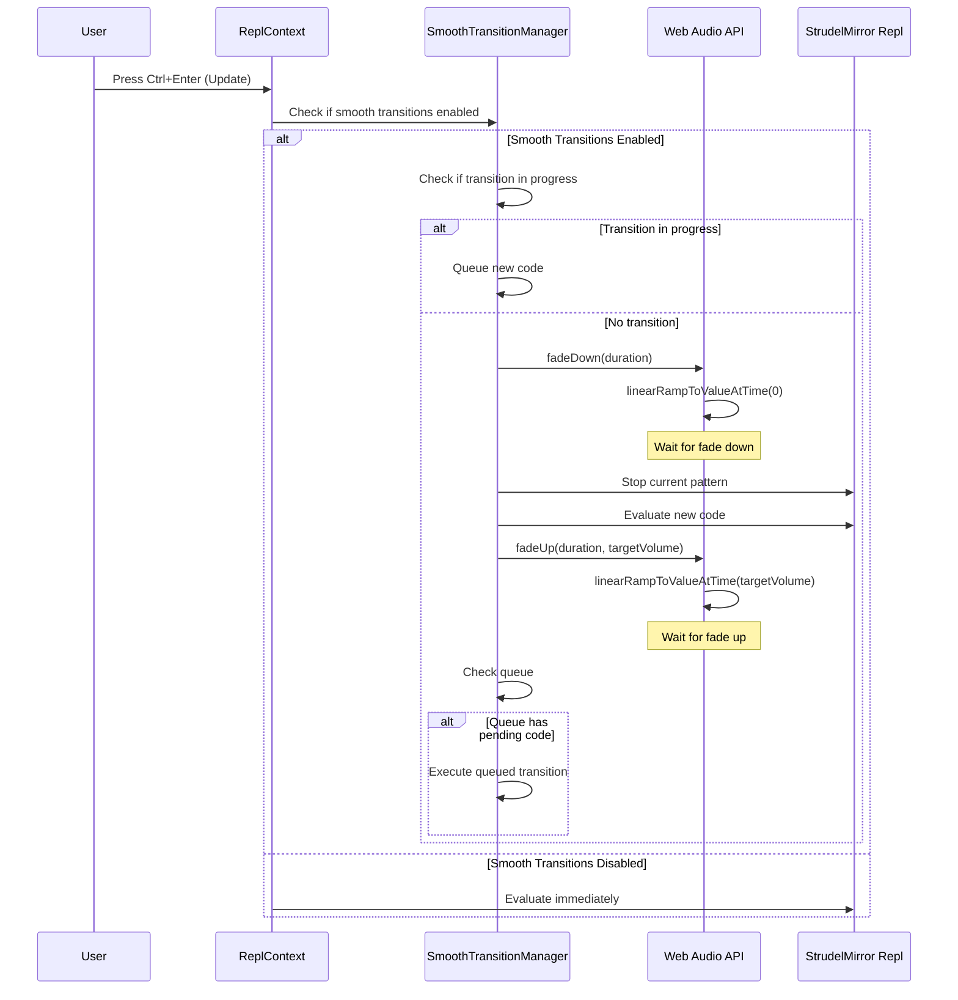

# Design Document: Smooth Track Transitions

## Overview

This feature adds configurable smooth volume transitions when users update their live code in Strudel. The system implements a two-phase fade transition: fade down the current track to silence, then fade up the new track to the target volume. This creates a professional, Spotify-like listening experience during live coding sessions.

The design integrates with Strudel's existing Web Audio API architecture, adding a new `SmoothTransitionManager` class that orchestrates volume fades on the main audio output chain. Settings are managed through the existing MixerSettings UI component and persisted to localStorage.

## Architecture

### System Components

```
┌─────────────────────────────────────────────────────────────┐
│                    User Interface Layer                      │
│  ┌──────────────────┐         ┌─────────────────────────┐  │
│  │ MixerSettings.tsx│────────▶│ Settings Storage        │  │
│  │ - Toggle control │         │ (localStorage)          │  │
│  │ - Duration slider│         └─────────────────────────┘  │
│  └──────────────────┘                                        │
└─────────────────────────────────────────────────────────────┘
                           │
                           ▼
┌─────────────────────────────────────────────────────────────┐
│                   Transition Logic Layer                     │
│  ┌──────────────────────────────────────────────────────┐  │
│  │         SmoothTransitionManager                       │  │
│  │  - executeTransition(newCode)                        │  │
│  │  - fadeDown(duration)                                │  │
│  │  - fadeUp(duration, targetVolume)                    │  │
│  │  - queueTransition(newCode)                          │  │
│  └──────────────────────────────────────────────────────┘  │
└─────────────────────────────────────────────────────────────┘
                           │
                           ▼
┌─────────────────────────────────────────────────────────────┐
│                    Web Audio API Layer                       │
│  ┌──────────────────────────────────────────────────────┐  │
│  │  destinationGain (from SuperdoughAudioController)    │  │
│  │  - gain.linearRampToValueAtTime()                    │  │
│  │  - gain.setValueAtTime()                             │  │
│  └──────────────────────────────────────────────────────┘  │
└─────────────────────────────────────────────────────────────┘
```

### Integration Points

1. **useReplContext.tsx**: Modified to instantiate `SmoothTransitionManager` and intercept `handleEvaluate` calls
2. **MixerSettings.tsx**: Extended to include smooth transition toggle and duration controls
3. **SuperdoughAudioController**: Existing `destinationGain` node used for volume control
4. **localStorage**: Stores user preferences for smooth transitions

### Transition Flow



## Components and Interfaces

### SmoothTransitionManager

A new class that manages smooth volume transitions for track updates.

**Location**: `packages/mixer/SmoothTransitionManager.mjs`

**Constructor**:
```javascript
constructor(audioContext, replInstance, options = {})
```

**Parameters**:
- `audioContext`: Web Audio API AudioContext instance
- `replInstance`: StrudelMirror repl instance for pattern evaluation
- `options`: Configuration object
  - `enabled`: Boolean, default false
  - `duration`: Number (seconds), default 2.0
  - `destinationGain`: GainNode to control (from SuperdoughAudioController)

**Public Methods**:

```javascript
/**
 * Execute a smooth transition to new code
 * @param {string} newCode - The new pattern code to evaluate
 * @returns {Promise<void>}
 */
async executeTransition(newCode)

/**
 * Update transition settings
 * @param {Object} settings - { enabled, duration }
 */
updateSettings(settings)

/**
 * Get current settings
 * @returns {Object} - { enabled, duration, isTransitioning }
 */
getSettings()

/**
 * Cleanup resources
 */
destroy()
```

**Private Methods**:

```javascript
/**
 * Fade down current track to silence
 * @param {number} duration - Fade duration in seconds
 * @returns {Promise<void>}
 */
async fadeDown(duration)

/**
 * Fade up new track to target volume
 * @param {number} duration - Fade duration in seconds
 * @param {number} targetVolume - Target volume level (0-1)
 * @returns {Promise<void>}
 */
async fadeUp(duration, targetVolume)

/**
 * Queue a transition for later execution
 * @param {string} newCode - Code to queue
 */
queueTransition(newCode)

/**
 * Process queued transitions
 * @returns {Promise<void>}
 */
async processQueue()

/**
 * Persist settings to localStorage
 */
persistSettings()

/**
 * Restore settings from localStorage
 */
restoreSettings()
```

**State**:
```javascript
{
  enabled: boolean,
  duration: number,
  isTransitioning: boolean,
  queuedCode: string | null,
  targetVolume: number,
  audioContext: AudioContext,
  replInstance: StrudelMirror,
  destinationGain: GainNode
}
```

### MixerSettings Component Updates

**Location**: `website/src/repl/components/panel/MixerSettings.tsx`

**New Props**:
```typescript
interface MixerSettingsProps {
  mixer: any; // PreviewEngine instance
  isDisabled?: boolean;
  smoothTransitionManager?: SmoothTransitionManager; // NEW
}
```

**New UI Elements**:

1. **Smooth Transitions Toggle**:
   - Label: "Smooth Track Transitions"
   - Description: "Fade between tracks when updating code"
   - Type: Checkbox/Toggle
   - Default: Off

2. **Transition Duration Slider**:
   - Label: "Transition Duration"
   - Range: 0.5 - 10.0 seconds
   - Step: 0.5 seconds
   - Default: 2.0 seconds
   - Only visible when smooth transitions enabled

### useReplContext Integration

**Location**: `website/src/repl/useReplContext.tsx`

**Changes**:

1. Add state for `SmoothTransitionManager`:
```typescript
const smoothTransitionManagerRef = useRef<SmoothTransitionManager | null>(null);
```

2. Initialize manager in `useEffect`:
```typescript
useEffect(() => {
  if (editorRef.current?.repl && audioContext) {
    const controller = getSuperdoughController();
    const destinationGain = controller?.output?.destinationGain;
    
    if (destinationGain) {
      smoothTransitionManagerRef.current = new SmoothTransitionManager(
        audioContext,
        editorRef.current.repl,
        { destinationGain }
      );
    }
  }
  
  return () => {
    smoothTransitionManagerRef.current?.destroy();
  };
}, []);
```

3. Modify `handleEvaluate`:
```typescript
const handleEvaluate = async (): Promise<void> => {
  await cleanupCanvasElements();
  
  const manager = smoothTransitionManagerRef.current;
  const code = editorRef.current?.code;
  
  if (manager && manager.getSettings().enabled && code) {
    // Use smooth transition
    await manager.executeTransition(code);
  } else {
    // Use instant transition (current behavior)
    if (isPreviewing && mixerRef.current) {
      mixerRef.current.stop();
      setIsPreviewing(false);
    }
    
    if (editorRef.current && editorRef.current.evaluate) {
      editorRef.current.evaluate();
    }
  }
};
```

## Data Models

### Settings Storage Schema

**localStorage key**: `strudel-smooth-transitions`

**Schema**:
```typescript
interface SmoothTransitionSettings {
  enabled: boolean;
  duration: number; // seconds, 0.5 - 10.0
}
```

**Default values**:
```javascript
{
  enabled: false,
  duration: 2.0
}
```

### Transition State

**Internal state in SmoothTransitionManager**:
```typescript
interface TransitionState {
  isTransitioning: boolean;
  queuedCode: string | null;
  currentPhase: 'idle' | 'fading-down' | 'fading-up';
  targetVolume: number;
}
```

## Correctness Properties


A property is a characteristic or behavior that should hold true across all valid executions of a system—essentially, a formal statement about what the system should do. Properties serve as the bridge between human-readable specifications and machine-verifiable correctness guarantees.

### Property 1: Settings Persistence Round-Trip

*For any* valid smooth transition settings (enabled boolean and duration number), saving the settings to localStorage then loading them should produce equivalent values.

**Validates: Requirements 1.2, 1.3, 1.4, 4.3, 4.4, 7.1, 7.2, 7.3**

### Property 2: Fade Down Reaches Zero

*For any* starting volume level, when smooth transitions are enabled and a fade down executes, the final volume should be 0.

**Validates: Requirements 2.1**

### Property 3: Transition Timing Bounds

*For any* configured transition duration D, both fade down and fade up phases should complete within D seconds (plus a small tolerance for Web Audio API scheduling, e.g., D + 0.1 seconds).

**Validates: Requirements 2.2, 3.3**

### Property 4: Track Stops After Fade Down

*For any* track, when a fade down transition completes, the track's pattern should be stopped (no longer producing audio events).

**Validates: Requirements 2.3**

### Property 5: Instant Mode Immediate Stop

*For any* track, when smooth transitions are disabled, triggering an update should stop the current track immediately without any fade duration.

**Validates: Requirements 2.4**

### Property 6: New Track Starts at Zero Volume

*For any* new track code, when smooth transitions are enabled and the fade up phase begins, the initial volume should be 0.

**Validates: Requirements 3.1**

### Property 7: Fade Up Reaches Target Volume

*For any* target volume V (where 0 ≤ V ≤ 1), when a fade up transition completes, the final volume should equal V.

**Validates: Requirements 3.2, 6.1**

### Property 8: Instant Mode Immediate Start

*For any* track, when smooth transitions are disabled, the new track should start immediately at the target volume without any fade duration.

**Validates: Requirements 3.4**

### Property 9: Duration Validation

*For any* duration value D, the system should accept D if 0.5 ≤ D ≤ 10.0, and reject or clamp D otherwise.

**Validates: Requirements 4.2**

### Property 10: Sequential Transition Phases

*For any* smooth transition, the fade down phase must complete before the fade up phase begins (temporal ordering).

**Validates: Requirements 5.1**

### Property 11: Transition Mutual Exclusion

*For any* transition in progress, attempting to start a new transition should either queue the new transition or throw an error, but never execute two transitions simultaneously.

**Validates: Requirements 5.2**

### Property 12: Update Queueing During Transition

*For any* update triggered while a transition is in progress, the update code should be queued and executed after the current transition completes.

**Validates: Requirements 5.3**

### Property 13: Queued Transition Execution

*For any* queued update, when the current transition completes, the queued update should execute immediately (within a small scheduling tolerance).

**Validates: Requirements 5.4**

### Property 14: Dynamic Target Volume Adjustment

*For any* volume change during a transition, the fade target should adjust to the new volume value, and the final volume should match the most recent target.

**Validates: Requirements 6.2**

### Property 15: Final Volume Invariant

*For any* completed smooth transition, the destinationGain.gain.value should equal the target volume (within a small tolerance for floating-point precision, e.g., ±0.001).

**Validates: Requirements 6.3**

### Property 16: Live Stream Isolation

*For any* smooth transition on the live stream, the preview stream's volume and playback state should remain unchanged.

**Validates: Requirements 8.1**

### Property 17: Preview Crossfade Preservation

*For any* preview mode transition, the existing TransitionMixer crossfade functionality should execute without interference from the smooth transition system.

**Validates: Requirements 8.2**

### Property 18: Independent Transition Behaviors

*For any* sequence of live and preview transitions, each system should maintain its own settings and state independently (changing live settings should not affect preview settings and vice versa).

**Validates: Requirements 8.3**

### Property 19: TransitionMixer Non-Interference

*For any* TransitionMixer operation (instant switch or crossfade between live/preview streams), the SmoothTransitionManager should not modify the TransitionMixer's state or behavior.

**Validates: Requirements 8.4**

## Error Handling

### Transition Errors

**Scenario**: Transition fails mid-execution (e.g., Web Audio API error, repl evaluation error)

**Handling**:
1. Log error to console with context
2. Reset `isTransitioning` flag to allow new transitions
3. Restore volume to target level (don't leave audio muted)
4. Process queued transitions if any exist
5. Emit error event for UI notification

**Implementation**:
```javascript
try {
  await this.fadeDown(duration);
  await this.replInstance.evaluate(newCode);
  await this.fadeUp(duration, this.targetVolume);
} catch (error) {
  console.error('[SmoothTransitionManager] Transition failed:', error);
  
  // Restore volume to prevent muted audio
  const now = this.audioContext.currentTime;
  this.destinationGain.gain.cancelScheduledValues(now);
  this.destinationGain.gain.setValueAtTime(this.targetVolume, now);
  
  // Emit error event
  this.emitEvent('transition-error', { error: error.message });
} finally {
  this.isTransitioning = false;
  await this.processQueue();
}
```

### localStorage Errors

**Scenario**: localStorage is unavailable or quota exceeded

**Handling**:
1. Catch all localStorage operations in try-catch blocks
2. Use default values when loading fails
3. Continue operation without persistence (in-memory only)
4. Log warning but don't throw errors

**Implementation**:
```javascript
persistSettings() {
  try {
    localStorage.setItem('strudel-smooth-transitions', JSON.stringify({
      enabled: this.enabled,
      duration: this.duration
    }));
  } catch (error) {
    console.warn('[SmoothTransitionManager] Failed to persist settings:', error);
    // Continue without persistence
  }
}
```

### Invalid Settings

**Scenario**: User provides invalid duration or settings

**Handling**:
1. Validate all inputs before applying
2. Clamp duration to valid range (0.5 - 10.0)
3. Coerce enabled to boolean
4. Log validation warnings

**Implementation**:
```javascript
updateSettings(settings) {
  if (settings.duration !== undefined) {
    const duration = Number(settings.duration);
    if (isNaN(duration)) {
      console.warn('[SmoothTransitionManager] Invalid duration, using default');
      this.duration = 2.0;
    } else {
      this.duration = Math.max(0.5, Math.min(10.0, duration));
    }
  }
  
  if (settings.enabled !== undefined) {
    this.enabled = Boolean(settings.enabled);
  }
  
  this.persistSettings();
}
```

### Audio Context Suspended

**Scenario**: AudioContext is suspended when transition starts

**Handling**:
1. Check AudioContext state before transition
2. Resume AudioContext if suspended
3. Wait for resume to complete before starting fade
4. Timeout after 5 seconds if resume fails

**Implementation**:
```javascript
async ensureAudioContextRunning() {
  if (this.audioContext.state === 'suspended') {
    console.log('[SmoothTransitionManager] Resuming suspended AudioContext');
    try {
      await Promise.race([
        this.audioContext.resume(),
        new Promise((_, reject) => 
          setTimeout(() => reject(new Error('AudioContext resume timeout')), 5000)
        )
      ]);
    } catch (error) {
      throw new Error('Failed to resume AudioContext: ' + error.message);
    }
  }
}
```

## Testing Strategy

### Dual Testing Approach

This feature requires both unit tests and property-based tests for comprehensive coverage:

**Unit Tests**: Focus on specific examples, edge cases, and integration points
- Specific transition scenarios (enabled/disabled)
- Edge cases (localStorage unavailable, invalid settings)
- Integration with existing components (useReplContext, MixerSettings)
- Error conditions (transition failures, audio context issues)

**Property-Based Tests**: Verify universal properties across all inputs
- Settings persistence round-trips
- Volume fade behaviors across all starting/target volumes
- Timing constraints across all duration values
- Queue behavior across all transition sequences
- Isolation properties between live and preview streams

### Property-Based Testing Configuration

**Library**: Use `fast-check` for JavaScript/TypeScript property-based testing

**Configuration**:
- Minimum 100 iterations per property test
- Each test tagged with feature name and property number
- Tag format: `Feature: smooth-track-transitions, Property N: [property text]`

**Example Property Test**:
```javascript
import fc from 'fast-check';

// Feature: smooth-track-transitions, Property 1: Settings Persistence Round-Trip
test('settings persistence round-trip', async () => {
  await fc.assert(
    fc.asyncProperty(
      fc.boolean(), // enabled
      fc.float({ min: 0.5, max: 10.0 }), // duration
      async (enabled, duration) => {
        const manager = new SmoothTransitionManager(audioContext, repl, { destinationGain });
        
        // Save settings
        manager.updateSettings({ enabled, duration });
        
        // Create new manager and restore
        const manager2 = new SmoothTransitionManager(audioContext, repl, { destinationGain });
        const restored = manager2.getSettings();
        
        // Verify round-trip
        expect(restored.enabled).toBe(enabled);
        expect(restored.duration).toBeCloseTo(duration, 2);
        
        // Cleanup
        manager.destroy();
        manager2.destroy();
      }
    ),
    { numRuns: 100 }
  );
});
```

### Unit Test Coverage

**SmoothTransitionManager Tests** (`packages/mixer/test/SmoothTransitionManager.test.mjs`):
1. Constructor initializes with correct defaults
2. Settings persistence and restoration
3. Fade down reduces volume to 0
4. Fade up increases volume to target
5. Sequential phase execution
6. Transition queueing when busy
7. Queue processing after completion
8. Instant mode bypasses transitions
9. Error recovery and cleanup
10. Dynamic target volume adjustment

**Integration Tests** (`website/src/repl/test/smoothTransitions.test.tsx`):
1. MixerSettings UI renders controls correctly
2. Toggle changes persist to localStorage
3. Duration slider updates settings
4. handleEvaluate uses smooth transitions when enabled
5. handleEvaluate uses instant mode when disabled
6. Preview mode unaffected by smooth transitions
7. Settings survive page reload

### Test Execution

Run tests with:
```bash
# All tests
pnpm test

# Specific package
pnpm --filter @strudel/mixer test

# With coverage
pnpm test-coverage

# Watch mode (for development)
pnpm --filter @strudel/mixer test -- --watch
```

### Manual Testing Checklist

1. Enable smooth transitions in settings
2. Update code (Ctrl+Enter) and verify fade down → fade up
3. Adjust duration slider and verify timing changes
4. Trigger multiple rapid updates and verify queueing
5. Disable smooth transitions and verify instant mode
6. Change master volume during transition and verify adjustment
7. Use preview mode and verify independence
8. Reload page and verify settings persist
9. Test with localStorage disabled (private browsing)
10. Test error recovery (invalid code, audio context issues)
